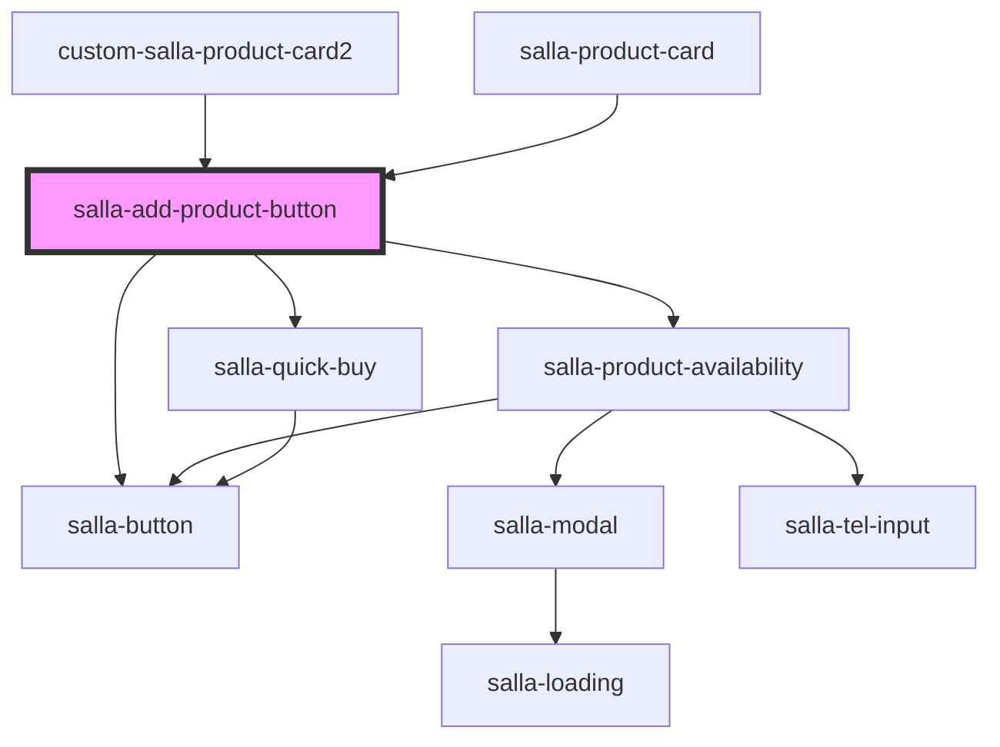

# salla-add-product-button

<!-- Auto Generated Below -->

## Properties

| Property                    | Attribute                     | Description                                             | Type                                                                                                      | Default     |
| --------------------------- | ----------------------------- | ------------------------------------------------------- | --------------------------------------------------------------------------------------------------------- | ----------- |
| `channels`                  | `channels`                    | Channels.                                               | `string`                                                                                                  | `undefined` |
| `donatingAmount`            | `donating-amount`             | Donating amount.                                        | `number`                                                                                                  | `undefined` |
| `notifyOptionsAvailability` | `notify-options-availability` | Listen to product options availability.                 | `boolean`                                                                                                 | `undefined` |
| `productId`                 | `product-id`                  | Product id                                              | `any`                                                                                                     | `undefined` |
| `productStatus`             | `product-status`              | Product Status.Defaults to `sale`                       | `"out" \| "out-and-notify" \| "sale"`                                                                     | `'sale'`    |
| `productType`               | `product-type`                | Product type. Defaults to `product`                     | `"booking" \| "codes" \| "digital" \| "donating" \| "food" \| "group_products" \| "product" \| "service"` | `'product'` |
| `quantity`                  | `quantity`                    | Product Quantity                                        | `number`                                                                                                  | `undefined` |
| `quickBuy`                  | `quick-buy`                   | Support Quick Pay Button                                | `boolean`                                                                                                 | `undefined` |
| `subscribedOptions`         | `subscribed-options`          | Subscribed Options ex: "[[139487,2394739],[1212,1544]]" | `string`                                                                                                  | `undefined` |
| `supportStickyBar`          | `support-sticky-bar`          | Support themes that have a sticky bar                   | `boolean`                                                                                                 | `undefined` |

## Events

| Event     | Description                                                             | Type               |
| --------- | ----------------------------------------------------------------------- | ------------------ |
| `failed`  | Custome DOM event emitter when product addition to cart fails.          | `CustomEvent<any>` |
| `success` | Custome DOM event emitter when product gets added to cart successfully. | `CustomEvent<any>` |

## Dependencies

### Used by

 - [custom-salla-product-card2](../custom-salla-product-card2)
 - [salla-product-card](../salla-product-card)

### Depends on

- [salla-product-availability](../salla-product-availability)
- [salla-button](../salla-button)
- [salla-quick-buy](../salla-quick-buy)

### Graph

----------------------------------------------

*Built with [StencilJS](https://stenciljs.com/)*
