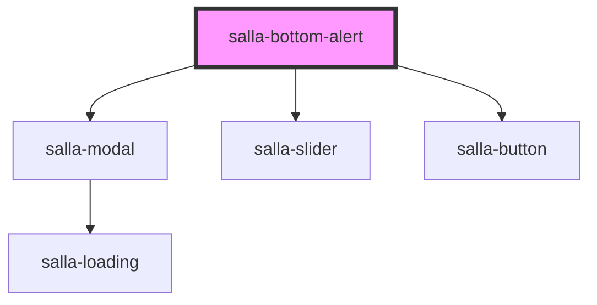

# salla-bottom-alert

<!-- Auto Generated Below -->

## Properties

| Property      | Attribute      | Description                                                | Type                            | Default     |
| ------------- | -------------- | ---------------------------------------------------------- | ------------------------------- | ----------- |
| `actionLabel` | `action-label` | Button label - used when type is link and popup            | `string`                        | `undefined` |
| `actionUrl`   | `action-url`   | Button url - used when type is link                        | `string`                        | `undefined` |
| `icon`        | `icon`         | Alert Icon class from salla icons library - ex: sicon-user | `string`                        | `undefined` |
| `message`     | `message`      | Alert Message                                              | `string`                        | `undefined` |
| `type`        | `type`         | Alert Type                                                 | `"banner" \| "link" \| "popup"` | `'popup'`   |

## Dependencies

### Depends on

- [salla-modal](../salla-modal)
- [salla-slider](../salla-slider)
- [salla-button](../salla-button)

### Graph

----------------------------------------------

*Built with [StencilJS](https://stenciljs.com/)*
