# salla-button

<!-- Auto Generated Below -->

## Properties

| Property         | Attribute         | Description                                                   | Type                                                                             | Default     |
| ---------------- | ----------------- | ------------------------------------------------------------- | -------------------------------------------------------------------------------- | ----------- |
| `color`          | `color`           | Button Color                                                  | `"danger" \| "dark" \| "gray" \| "light" \| "primary" \| "success" \| "warning"` | `'primary'` |
| `disabled`       | `disabled`        | Is the button currently disabled                              | `boolean`                                                                        | `false`     |
| `fill`           | `fill`            | Button Fill                                                   | `"none" \| "outline" \| "solid"`                                                 | `'solid'`   |
| `href`           | `href`            | Button with href as normal link                               | `string`                                                                         | `undefined` |
| `loaderPosition` | `loader-position` | If there is need to change loader position, pass the position | `"after" \| "center" \| "end" \| "start"`                                        | `'after'`   |
| `loading`        | `loading`         | Is the button currently loading                               | `boolean`                                                                        | `false`     |
| `shape`          | `shape`           | Button Type                                                   | `"btn" \| "icon" \| "link"`                                                      | `'btn'`     |
| `size`           | `size`            | Button Size                                                   | `"large" \| "medium" \| "small"`                                                 | `'medium'`  |
| `width`          | `width`           | Button Width                                                  | `"normal" \| "wide"`                                                             | `'normal'`  |

## Methods

### `disable() => Promise<HTMLElement>`

Add `disabled` attribute

#### Returns

Type: `Promise<HTMLElement>`

### `enable() => Promise<HTMLElement>`

Remove `disabled` attribute

#### Returns

Type: `Promise<HTMLElement>`

### `load() => Promise<HTMLElement>`

Run loading animation

#### Returns

Type: `Promise<HTMLElement>`

### `setText(html: string) => Promise<HTMLElement>`

Changing the body of the button

#### Returns

Type: `Promise<HTMLElement>`

### `stop() => Promise<HTMLElement>`

Stop loading animation

#### Returns

Type: `Promise<HTMLElement>`

## Dependencies

### Used by

 - [salla-add-product-button](../salla-add-product-button)
 - [salla-bottom-alert](../salla-bottom-alert)
 - [salla-comment-form](../salla-comment-form)
 - [salla-filters](../salla-filters)
 - [salla-gifting](../salla-gifting)
 - [salla-localization-modal](../salla-localization-modal)
 - [salla-login-modal](../salla-login-modal)
 - [salla-loyalty](../salla-loyalty)
 - [salla-map](../salla-map)
 - [salla-offer-modal](../salla-offer-modal)
 - [salla-product-availability](../salla-product-availability)
 - [salla-product-card](../salla-product-card)
 - [salla-quick-buy](../salla-quick-buy)
 - [salla-quick-order](../salla-quick-order)
 - [salla-rating-modal](../salla-rating-modal)
 - [salla-scopes](../salla-scopes)
 - [salla-social-share](../salla-social-share)
 - [salla-user-settings](../salla-user-settings)
 - [salla-verify](../salla-verify)

### Graph

```mermaid
graph TD;
  salla-add-product-button --> salla-button
  salla-bottom-alert --> salla-button
  salla-comment-form --> salla-button
  salla-filters --> salla-button
  salla-gifting --> salla-button
  salla-localization-modal --> salla-button
  salla-login-modal --> salla-button
  salla-loyalty --> salla-button
  salla-map --> salla-button
  salla-offer-modal --> salla-button
  salla-product-availability --> salla-button
  salla-product-card --> salla-button
  salla-quick-buy --> salla-button
  salla-quick-order --> salla-button
  salla-rating-modal --> salla-button
  salla-scopes --> salla-button
  salla-social-share --> salla-button
  salla-user-settings --> salla-button
  salla-verify --> salla-button
  style salla-button fill:#f9f,stroke:#333,stroke-width:4px
```

----------------------------------------------

*Built with [StencilJS](https://stenciljs.com/)*
