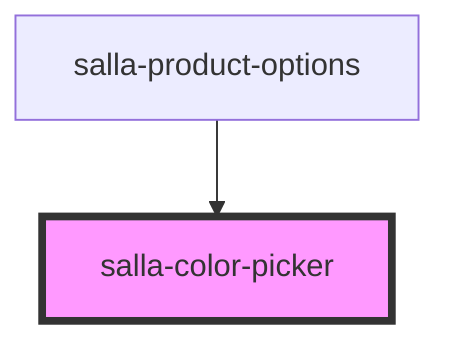

# salla-color-picker

<!-- Auto Generated Below -->

## Properties

| Property           | Attribute            | Description                                                                                              | Type                      | Default     |
| ------------------ | -------------------- | -------------------------------------------------------------------------------------------------------- | ------------------------- | ----------- |
| `color`            | `color`              | Initial color for the picker.                                                                            | `string`                  | `undefined` |
| `enableAlpha`      | `enable-alpha`       | Whether to enable adjusting the alpha channel.                                                           | `boolean`                 | `false`     |
| `format`           | `format`             | How to display the selected color in the text field (the text field still supports input in any format). | `"hex" \| "hsl" \| "rgb"` | `'hex'`     |
| `name`             | `name`               | File input name for the native formData                                                                  | `string`                  | `'color'`   |
| `required`         | `required`           | Set if the color picker input is required or not                                                         | `boolean`                 | `false`     |
| `showCancelButton` | `show-cancel-button` | Whether to have a "Cancel" button which closes the popup.                                                | `boolean`                 | `false`     |
| `showTextField`    | `show-text-field`    | Whether to show a text field for color value editing.                                                    | `boolean`                 | `true`      |

## Events

| Event          | Description                              | Type                 |
| -------------- | ---------------------------------------- | -------------------- |
| `colorChanged` | Event whenever the color changes.        | `CustomEvent<Color>` |
| `invalidInput` | Event emitted when the input is invalid. | `CustomEvent<any>`   |
| `popupClosed`  | Event emitter when the popup closes.     | `CustomEvent<Color>` |
| `popupOpened`  | Event emitter when the popup opens.      | `CustomEvent<Color>` |
| `submitted`    | Event emitter when the user clicks "Ok". | `CustomEvent<Color>` |

## Methods

### `closePicker() => Promise<void>`

Close/Hide the picker.

#### Returns

Type: `Promise<void>`

### `destroyPicker() => Promise<void>`

Release all resources used by this picker instance.

#### Returns

Type: `Promise<void>`

### `movePopUp(options: Options, openImmediately: boolean) => Promise<void>`

Move the popup to a different parent, optionally opening it at the same time.

(Usually a new .parent and .color).

#### Returns

Type: `Promise<void>`

### `openPicker() => Promise<void>`

Show/open the picker.

#### Returns

Type: `Promise<void>`

### `setColorValue(color: string, triggerEvent: boolean) => Promise<void>`

Set/initialize the picker's color.

Color name, RGBA/HSLA/HEX string, or RGBA array.

#### Returns

Type: `Promise<void>`

### `setPickerOption(options: Options) => Promise<void>`

Set the picker options.

(Usually a new .parent and .color).

#### Returns

Type: `Promise<void>`

## Dependencies

### Used by

 - [salla-product-options](../salla-product-options)

### Graph

----------------------------------------------

*Built with [StencilJS](https://stenciljs.com/)*
