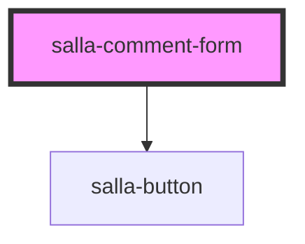

# salla-comment-form

<!-- Auto Generated Below -->

## Properties

| Property     | Attribute     | Description                                                                                                            | Type                  | Default     |
| ------------ | ------------- | ---------------------------------------------------------------------------------------------------------------------- | --------------------- | ----------- |
| `itemId`     | `item-id`     | The ID of the item(as defined in the type), where the comment is for. defaults to `salla.config.get('page.id')`        | `number \| string`    | `undefined` |
| `showAvatar` | `show-avatar` | To show the avatar or not in the comment form                                                                          | `boolean`             | `undefined` |
| `type`       | `type`        | Type of entity the comment is being submitted for. Defaults to `salla.url.is_page('page-single') ? 'page' : 'product'` | `"page" \| "product"` | `undefined` |

## Dependencies

### Depends on

- [salla-button](../salla-button)

### Graph

----------------------------------------------

*Built with [StencilJS](https://stenciljs.com/)*
