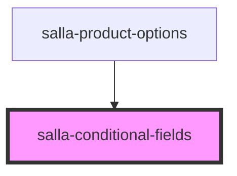

# salla-conditional-fields

<!-- Auto Generated Below -->

## Overview

its to easy to use, currenlty its support select & checkbox input as trigger for show/hide the dom
the dom you can put it like this data-show-when="{name of the field} {= or !=} {value of the field}"

## Dependencies

### Used by

 - [salla-product-options](../salla-product-options)

### Graph

----------------------------------------------

*Built with [StencilJS](https://stenciljs.com/)*
