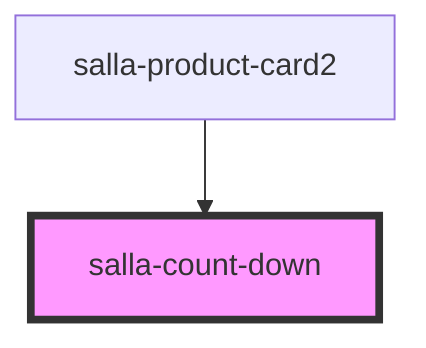

# salla-count-down

<!-- Auto Generated Below -->

## Properties

| Property   | Attribute    | Description                                                                         | Type                             | Default     |
| ---------- | ------------ | ----------------------------------------------------------------------------------- | -------------------------------- | ----------- |
| `boxed`    | `boxed`      | If true, the count down numbers will be appear in a boxes                           | `boolean`                        | `undefined` |
| `color`    | `color`      | The color of the count down                                                         | `"dark" \| "light" \| "primary"` | `'dark'`    |
| `date`     | `date`       | The date to count down to Format: MMM DD, YYYY HH:mm:ss (e.g. Jan 2, 2023 16:37:52) | `string`                         | `undefined` |
| `digits`   | `digits`     | The digits lang to show in the count down                                           | `"auto" \| "en"`                 | `'auto'`    |
| `endOfDay` | `end-of-day` | If true, the count down will end at the end of the day                              | `boolean`                        | `undefined` |
| `endText`  | `end-text`   | The text to show when the count down ends                                           | `string`                         | `undefined` |
| `labeled`  | `labeled`    | Show labels for each count down number                                              | `boolean`                        | `undefined` |
| `size`     | `size`       | The size of the count down                                                          | `"lg" \| "md" \| "sm"`           | `'md'`      |

## Methods

### `endCountDown() => Promise<void>`

End the count down

#### Returns

Type: `Promise<void>`

## Dependencies

### Used by

 - [salla-product-card2](../salla-product-card)

### Graph

----------------------------------------------

*Built with [StencilJS](https://stenciljs.com/)*
