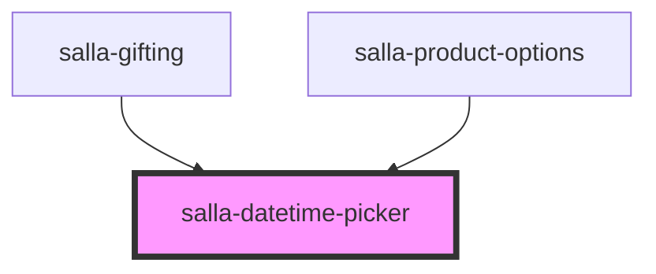

# salla-datetime-picker

<!-- Auto Generated Below -->

## Properties

| Property                | Attribute                 | Description                                                                                                                                                                                                                                        | Type                                                                                                                                                                                                                                                                                                                                                                                                                                                                                                                                                  | Default                                                          |
| ----------------------- | ------------------------- | -------------------------------------------------------------------------------------------------------------------------------------------------------------------------------------------------------------------------------------------------- | ----------------------------------------------------------------------------------------------------------------------------------------------------------------------------------------------------------------------------------------------------------------------------------------------------------------------------------------------------------------------------------------------------------------------------------------------------------------------------------------------------------------------------------------------------- | ---------------------------------------------------------------- |
| `allowInput`            | `allow-input`             | Allows the user to enter a date directly into the input field. By default, direct entry is disabled.                                                                                                                                               | `boolean`                                                                                                                                                                                                                                                                                                                                                                                                                                                                                                                                             | `true`                                                           |
| `allowInvalidPreload`   | `allow-invalid-preload`   | Allows the preloading of an invalid date. When disabled, the field will be cleared if the provided date is invalid                                                                                                                                 | `boolean`                                                                                                                                                                                                                                                                                                                                                                                                                                                                                                                                             | `false`                                                          |
| `altFormat`             | `alt-format`              | Exactly the same as date format, but for the altInput field.                                                                                                                                                                                       | `string`                                                                                                                                                                                                                                                                                                                                                                                                                                                                                                                                              | `"F j, Y"`                                                       |
| `altInput`              | `alt-input`               | Show the user a readable date (as per altFormat), but return something totally different to the server.                                                                                                                                            | `boolean`                                                                                                                                                                                                                                                                                                                                                                                                                                                                                                                                             | `false`                                                          |
| `altInputClass`         | `alt-input-class`         | This class will be added to the input element created by the altInput option. Note that altInput already inherits classes from the original input.                                                                                                 | `string`                                                                                                                                                                                                                                                                                                                                                                                                                                                                                                                                              | `undefined`                                                      |
| `appendTo`              | --                        | Instead of body, appends the calendar to the specified node instead.                                                                                                                                                                               | `HTMLElement`                                                                                                                                                                                                                                                                                                                                                                                                                                                                                                                                         | `undefined`                                                      |
| `ariaDateFormat`        | `aria-date-format`        | Defines how the date will be formatted in the aria-label for calendar days, using the same tokens as dateFormat. If you change this, you should choose a value that will make sense if a screen reader reads it out loud.                          | `string`                                                                                                                                                                                                                                                                                                                                                                                                                                                                                                                                              | `"F j, Y"`                                                       |
| `autoFillDefaultTime`   | `auto-fill-default-time`  | Whether the default time should be auto-filled when the input is empty and gains or loses focus.                                                                                                                                                   | `boolean`                                                                                                                                                                                                                                                                                                                                                                                                                                                                                                                                             | `true`                                                           |
| `clickOpens`            | `click-opens`             | Whether clicking on the input should open the picker. Set it to false if you only want to open the calendar programmatically with [open()]                                                                                                         | `boolean`                                                                                                                                                                                                                                                                                                                                                                                                                                                                                                                                             | `true`                                                           |
| `closeOnSelect`         | `close-on-select`         | Whether calendar should close after date selection or not                                                                                                                                                                                          | `boolean`                                                                                                                                                                                                                                                                                                                                                                                                                                                                                                                                             | `true`                                                           |
| `conjunction`           | `conjunction`             | When in "multiple" mode, conjunction is used to separate dates in the entry field.                                                                                                                                                                 | `string`                                                                                                                                                                                                                                                                                                                                                                                                                                                                                                                                              | `undefined`                                                      |
| `dateFormat`            | `date-format`             | A string of characters which are used to define how the date will be displayed in the input box. The supported characters are defined in the table below.                                                                                          | `string`                                                                                                                                                                                                                                                                                                                                                                                                                                                                                                                                              | `"Y-m-d"`                                                        |
| `dateParser`            | --                        | A custom datestring parser                                                                                                                                                                                                                         | `(date: string, format: string) => Date`                                                                                                                                                                                                                                                                                                                                                                                                                                                                                                              | `undefined`                                                      |
| `defaultDate`           | `default-date`            | Sets the initial selected date(s). If you're using mode: "multiple" or a range calendar supply an Array of Date objects or an Array of date strings which follow your dateFormat. Otherwise, you can supply a single Date object or a date string. | `Date \| DateOption[] \| number \| string`                                                                                                                                                                                                                                                                                                                                                                                                                                                                                                            | `undefined`                                                      |
| `defaultHour`           | `default-hour`            | Initial value of the hour element, when no date is selected                                                                                                                                                                                        | `number`                                                                                                                                                                                                                                                                                                                                                                                                                                                                                                                                              | `12`                                                             |
| `defaultMinute`         | `default-minute`          | Initial value of the minute element, when no date is selected                                                                                                                                                                                      | `number`                                                                                                                                                                                                                                                                                                                                                                                                                                                                                                                                              | `0`                                                              |
| `defaultSeconds`        | `default-seconds`         | Initial value of the seconds element, when no date is selected                                                                                                                                                                                     | `number`                                                                                                                                                                                                                                                                                                                                                                                                                                                                                                                                              | `0`                                                              |
| `disable`               | --                        | Disables certain dates, preventing them from being selected. See https://chmln.github.io/flatpickr/examples/#disabling-specific-dates                                                                                                              | `DateLimit<DateOption>[]`                                                                                                                                                                                                                                                                                                                                                                                                                                                                                                                             | `[]`                                                             |
| `disableMobile`         | `disable-mobile`          | Set this to true to always use the non-native picker on mobile devices. By default, Flatpickr utilizes native datetime widgets unless certain options (e.g. disable) are used.                                                                     | `boolean`                                                                                                                                                                                                                                                                                                                                                                                                                                                                                                                                             | `false`                                                          |
| `enable`                | --                        | Disables all dates except these specified. See https://chmln.github.io/flatpickr/examples/#disabling-all-dates-except-select-few                                                                                                                   | `DateLimit<DateOption>[]`                                                                                                                                                                                                                                                                                                                                                                                                                                                                                                                             | `[(_) => true]`                                                  |
| `enableSeconds`         | `enable-seconds`          | Enables seconds selection in the time picker.                                                                                                                                                                                                      | `boolean`                                                                                                                                                                                                                                                                                                                                                                                                                                                                                                                                             | `false`                                                          |
| `enableTime`            | `enable-time`             | Enables the time picker                                                                                                                                                                                                                            | `boolean`                                                                                                                                                                                                                                                                                                                                                                                                                                                                                                                                             | `false`                                                          |
| `formatDate`            | --                        | Allows using a custom date formatting function instead of the built-in handling for date formats using dateFormat, altFormat, etc.                                                                                                                 | `(date: Date, format: string, locale: Object) => string`                                                                                                                                                                                                                                                                                                                                                                                                                                                                                              | `undefined`                                                      |
| `hourIncrement`         | `hour-increment`          | Adjusts the step for the hour input (incl. scrolling)                                                                                                                                                                                              | `number`                                                                                                                                                                                                                                                                                                                                                                                                                                                                                                                                              | `1`                                                              |
| `inline`                | `inline`                  | Displays the calendar inline                                                                                                                                                                                                                       | `boolean`                                                                                                                                                                                                                                                                                                                                                                                                                                                                                                                                             | `false`                                                          |
| `locale`                | `locale`                  | The locale, either as a string (e.g. "ar", "en") or as an object. See https://chmln.github.io/flatpickr/localization/                                                                                                                              | `"at" \| "default" \| "hr" \| "th" \| "tr" \| "id" \| "is" \| "cy" \| "no" \| "es" \| "ar" \| "az" \| "be" \| "bg" \| "bn" \| "bs" \| "ca" \| "cat" \| "ckb" \| "cs" \| "da" \| "de" \| "en" \| "eo" \| "et" \| "fa" \| "fi" \| "fo" \| "fr" \| "gr" \| "he" \| "hi" \| "hu" \| "hy" \| "it" \| "ja" \| "ka" \| "ko" \| "km" \| "kz" \| "lt" \| "lv" \| "mk" \| "mn" \| "ms" \| "my" \| "nl" \| "nn" \| "pa" \| "pl" \| "pt" \| "ro" \| "ru" \| "si" \| "sk" \| "sl" \| "sq" \| "sr" \| "sv" \| "uk" \| "vn" \| "zh" \| "uz" \| "uz_latn" \| "zh_tw"` | `"en"`                                                           |
| `maxDate`               | `max-date`                | The maximum date that a user can pick to (inclusive).                                                                                                                                                                                              | `Date \| number \| string`                                                                                                                                                                                                                                                                                                                                                                                                                                                                                                                            | `null`                                                           |
| `maxTime`               | `max-time`                | The minimum date that a user can start picking from (inclusive).                                                                                                                                                                                   | `Date \| number \| string`                                                                                                                                                                                                                                                                                                                                                                                                                                                                                                                            | `null`                                                           |
| `minDate`               | `min-date`                | The minimum date that a user can start picking from (inclusive).                                                                                                                                                                                   | `Date \| number \| string`                                                                                                                                                                                                                                                                                                                                                                                                                                                                                                                            | `null`                                                           |
| `minTime`               | `min-time`                | The minimum time that a user can start picking from (inclusive).                                                                                                                                                                                   | `Date \| number \| string`                                                                                                                                                                                                                                                                                                                                                                                                                                                                                                                            | `null`                                                           |
| `minuteIncrement`       | `minute-increment`        | Adjusts the step for the minute input (incl. scrolling) Defaults to 5                                                                                                                                                                              | `number`                                                                                                                                                                                                                                                                                                                                                                                                                                                                                                                                              | `5`                                                              |
| `mode`                  | `mode`                    | Date selection mode, defaults to "single"                                                                                                                                                                                                          | `"multiple" \| "range" \| "single" \| "time"`                                                                                                                                                                                                                                                                                                                                                                                                                                                                                                         | `"single"`                                                       |
| `monthSelectorType`     | `month-selector-type`     | How the month should be displayed in the header of the calendar. If showMonths has a value greater than 1, the month is always shown as static.                                                                                                    | `"dropdown" \| "static"`                                                                                                                                                                                                                                                                                                                                                                                                                                                                                                                              | `"dropdown"`                                                     |
| `name`                  | `name`                    | the name for the input                                                                                                                                                                                                                             | `string`                                                                                                                                                                                                                                                                                                                                                                                                                                                                                                                                              | `undefined`                                                      |
| `nextArrow`             | `next-arrow`              | HTML for the arrow icon, used to switch months.                                                                                                                                                                                                    | `string`                                                                                                                                                                                                                                                                                                                                                                                                                                                                                                                                              | `''`             |
| `noCalendar`            | `no-calendar`             | Hides the day selection in calendar. Use it along with enableTime to create a time picker.                                                                                                                                                         | `boolean`                                                                                                                                                                                                                                                                                                                                                                                                                                                                                                                                             | `false`                                                          |
| `placeholder`           | `placeholder`             | Placeholder text to show on the input element                                                                                                                                                                                                      | `string`                                                                                                                                                                                                                                                                                                                                                                                                                                                                                                                                              | `salla.lang.get('blocks.buy_as_gift.select_send_date_and_time')` |
| `position`              | `position`                | How the calendar should be positioned with regards to the input. Defaults to "auto"                                                                                                                                                                | `"above center" \| "above left" \| "above right" \| "above" \| "auto center" \| "auto left" \| "auto right" \| "auto" \| "below center" \| "below left" \| "below right" \| "below" \| ((self: any, customElement: HTMLElement) => void)`                                                                                                                                                                                                                                                                                                             | `"auto"`                                                         |
| `positionElement`       | --                        | The element off of which the calendar will be positioned. Defaults to the date input                                                                                                                                                               | `HTMLElement`                                                                                                                                                                                                                                                                                                                                                                                                                                                                                                                                         | `undefined`                                                      |
| `prevArrow`             | `prev-arrow`              | HTML for the left arrow icon, used to switch months.                                                                                                                                                                                               | `string`                                                                                                                                                                                                                                                                                                                                                                                                                                                                                                                                              | `''`              |
| `required`              | `required`                | Whether this input i required or not                                                                                                                                                                                                               | `boolean`                                                                                                                                                                                                                                                                                                                                                                                                                                                                                                                                             | `undefined`                                                      |
| `shorthandCurrentMonth` | `shorthand-current-month` | Whether to display the current month name in shorthand mode, e.g. "Sep" instead "September"                                                                                                                                                        | `boolean`                                                                                                                                                                                                                                                                                                                                                                                                                                                                                                                                             | `false`                                                          |
| `showMonths`            | `show-months`             | The number of months to be shown at the same time when displaying the calendar.                                                                                                                                                                    | `number`                                                                                                                                                                                                                                                                                                                                                                                                                                                                                                                                              | `1`                                                              |
| `static`                | `static`                  | Position the calendar inside the wrapper and next to the input element*.                                                                                                                                                                           | `boolean`                                                                                                                                                                                                                                                                                                                                                                                                                                                                                                                                             | `false`                                                          |
| `time_24hr`             | `time_-2-4hr`             | Displays time picker in 24 hour mode without AM/PM selection when enabled.                                                                                                                                                                         | `boolean`                                                                                                                                                                                                                                                                                                                                                                                                                                                                                                                                             | `false`                                                          |
| `value`                 | `value`                   | Two way data binding to retrieve the selected date[time] value                                                                                                                                                                                     | `string`                                                                                                                                                                                                                                                                                                                                                                                                                                                                                                                                              | `null`                                                           |
| `weekNumbers`           | `week-numbers`            | Enables display of week numbers in calendar.                                                                                                                                                                                                       | `boolean`                                                                                                                                                                                                                                                                                                                                                                                                                                                                                                                                             | `false`                                                          |
| `wrap`                  | `wrap`                    | See https://chmln.github.io/flatpickr/examples/#flatpickr-external-elements                                                                                                                                                                        | `boolean`                                                                                                                                                                                                                                                                                                                                                                                                                                                                                                                                             | `false`                                                          |

## Events

| Event          | Description                                                                        | Type               |
| -------------- | ---------------------------------------------------------------------------------- | ------------------ |
| `invalidInput` | Event emitted when the input is invalid.                                           | `CustomEvent<any>` |
| `picked`       | Event emitted when the date input gets changed by the user when selecting file(s). | `CustomEvent<any>` |

## Dependencies

### Used by

 - [salla-gifting](../salla-gifting)
 - [salla-product-options](../salla-product-options)

### Graph

----------------------------------------------

*Built with [StencilJS](https://stenciljs.com/)*
