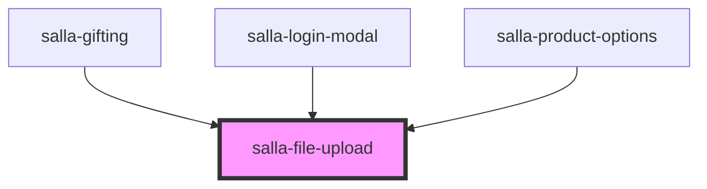

# salla-file-upload

<!-- Auto Generated Below -->

## Properties

| Property                  | Attribute                   | Description                                                                                                                                                                                                                                                                                                                                     | Type                                                                    | Default                                         |
| ------------------------- | --------------------------- | ----------------------------------------------------------------------------------------------------------------------------------------------------------------------------------------------------------------------------------------------------------------------------------------------------------------------------------------------- | ----------------------------------------------------------------------- | ----------------------------------------------- |
| `accept`                  | `accept`                    | Accepted file types                                                                                                                                                                                                                                                                                                                             | `string`                                                                | `"image/png, image/jpeg, image/jpg, image/gif"` |
| `allowBrowse`             | `allow-browse`              | Enable or disable file browser                                                                                                                                                                                                                                                                                                                  | `boolean`                                                               | `true`                                          |
| `allowDrop`               | `allow-drop`                | Enable or disable drag n' drop                                                                                                                                                                                                                                                                                                                  | `boolean`                                                               | `true`                                          |
| `allowMultiple`           | `allow-multiple`            | Enable or disable adding multiple files                                                                                                                                                                                                                                                                                                         | `boolean`                                                               | `undefined`                                     |
| `allowPaste`              | `allow-paste`               | Enable or disable pasting of files. Pasting files is not supported on all browesrs.                                                                                                                                                                                                                                                             | `boolean`                                                               | `undefined`                                     |
| `allowProcess`            | `allow-process`             | Enable or disable the process button                                                                                                                                                                                                                                                                                                            | `boolean`                                                               | `undefined`                                     |
| `allowRemove`             | `allow-remove`              | When set to false the remove button is hidden and disabled                                                                                                                                                                                                                                                                                      | `boolean`                                                               | `true`                                          |
| `allowReorder`            | `allow-reorder`             | Allow users to reorder files with drag and drop interaction. Note that this only works in single column mode. It also only works on browsers that support pointer events.                                                                                                                                                                       | `boolean`                                                               | `undefined`                                     |
| `allowReplace`            | `allow-replace`             | Allow drop to replace a file, only works when allowMultiple is false                                                                                                                                                                                                                                                                            | `boolean`                                                               | `true`                                          |
| `allowRevert`             | `allow-revert`              | Enable or disable the revert processing button                                                                                                                                                                                                                                                                                                  | `boolean`                                                               | `true`                                          |
| `cartItemId`              | `cart-item-id`              | to prepare the upload url automatically pass this prop, ex to upload attach file in cart Item.                                                                                                                                                                                                                                                  | `string`                                                                | `undefined`                                     |
| `checkValidity`           | `check-validity`            | Set to true to enable custom validity messages. FilePond will throw an error when a parent form is submitted and it contains invalid files.                                                                                                                                                                                                     | `boolean`                                                               | `undefined`                                     |
| `chunkForce`              | `chunk-force`               | Force chunks even for files smaller than the set chunkSize                                                                                                                                                                                                                                                                                      | `boolean`                                                               | `undefined`                                     |
| `chunkRetryDelays`        | --                          | Amount of times, and delayes, between retried uploading of a chunk                                                                                                                                                                                                                                                                              | `number[]`                                                              | `[500, 1000, 3000]`                             |
| `chunkSize`               | `chunk-size`                | The size of a chunk in bytes                                                                                                                                                                                                                                                                                                                    | `number`                                                                | `5000000`                                       |
| `chunkUploads`            | `chunk-uploads`             | Enable chunked uploads, when enabled will automatically cut up files in chunkSize chunks before upload.                                                                                                                                                                                                                                         | `boolean`                                                               | `undefined`                                     |
| `credits`                 | `credits`                   | Show credits at the bottom of the upload element. Structure is like [{label,url}]                                                                                                                                                                                                                                                               | `boolean`                                                               | `undefined`                                     |
| `disabled`                | `disabled`                  | Sets the disabled attribute to the output field                                                                                                                                                                                                                                                                                                 | `boolean`                                                               | `undefined`                                     |
| `dropOnElement`           | `drop-on-element`           | Require drop on the FilePond element itself to catch the file.                                                                                                                                                                                                                                                                                  | `boolean`                                                               | `true`                                          |
| `dropOnPage`              | `drop-on-page`              | FilePond will catch all files dropped on the webpage                                                                                                                                                                                                                                                                                            | `boolean`                                                               | `undefined`                                     |
| `dropValidation`          | `drop-validation`           | When enabled, files are validated before they are dropped. A file is not added when it's invalid.                                                                                                                                                                                                                                               | `boolean`                                                               | `undefined`                                     |
| `fileId`                  | `file-id`                   | If current file has id, pass it here, to be passed back in the `removed` event                                                                                                                                                                                                                                                                  | `number`                                                                | `undefined`                                     |
| `files`                   | `files`                     | The uploaded files as json `[{url:"...", id:123}]` for delete possibility                                                                                                                                                                                                                                                                       | `string`                                                                | `undefined`                                     |
| `forceRevert`             | `force-revert`              | Set to true to require the file to be successfully reverted before continuing.                                                                                                                                                                                                                                                                  | `boolean`                                                               | `undefined`                                     |
| `formData`                | `form-data`                 | json formData to be injected in the submit request                                                                                                                                                                                                                                                                                              | `string`                                                                | `"{}"`                                          |
| `height`                  | `height`                    | The original height of the uploader, will be used to reset the height after the image is removed.                                                                                                                                                                                                                                               | `string`                                                                | `undefined`                                     |
| `iconProcess`             | `icon-process`              | The icon used for process actions                                                                                                                                                                                                                                                                                                               | `string`                                                                | `'<svg>...</svg>'`                              |
| `iconRemove`              | `icon-remove`               | The icon used for remove actions                                                                                                                                                                                                                                                                                                                | `string`                                                                | `'<svg>...</svg>'`                              |
| `iconRetry`               | `icon-retry`                | The icon used for retry actions                                                                                                                                                                                                                                                                                                                 | `string`                                                                | `'<svg>...</svg>'`                              |
| `iconUndo`                | `icon-undo`                 | The icon used for undo actions                                                                                                                                                                                                                                                                                                                  | `string`                                                                | `'<svg>...</svg>'`                              |
| `ignoredFiles`            | --                          | Ignored file names when handling dropped directories. Dropping directories is not supported on all browsers.                                                                                                                                                                                                                                    | `any[]`                                                                 | `['.ds_store', 'thumbs.db', 'desktop.ini']`     |
| `instantUpload`           | `instant-upload`            | Immediately upload new files to the server                                                                                                                                                                                                                                                                                                      | `boolean`                                                               | `undefined`                                     |
| `itemInsertInterval`      | `item-insert-interval`      | The interval to use before showing each item being added to the list                                                                                                                                                                                                                                                                            | `number`                                                                | `75`                                            |
| `itemInsertLocation`      | `item-insert-location`      | Set to 'after' to add files to end of list (when dropped at the top of the list or added using browse or paste), set to 'before' to add files at start of list. Set to a compare function to automatically sort items when added                                                                                                                | `"after" \| "before" \| ((a: FilePondFile, b: FilePondFile) => number)` | `'after'`                                       |
| `labelDecimalSeparator`   | `label-decimal-separator`   | The decimal separator used to render numbers. By default this is determined automatically.                                                                                                                                                                                                                                                      | `string`                                                                | `undefined`                                     |
| `labelIdle`               | `label-idle`                | Default label shown to indicate this is a drop area. FilePond will automatically bind browse file events to the element with CSS class .filepond--label-action                                                                                                                                                                                  | `string`                                                                | `undefined`                                     |
| `labelThousandsSeparator` | `label-thousands-separator` | The thousdands separator used to render numbers. By default this is determined automatically.                                                                                                                                                                                                                                                   | `string`                                                                | `undefined`                                     |
| `maxFileSize`             | `max-file-size`             | The maximum size of a file, for instance 2MB or 750KB                                                                                                                                                                                                                                                                                           | ``${number}KB}` \| `${number}MB``                                       | `'2MB'`                                         |
| `maxFilesCount`           | `max-files-count`           | The maximum number of files that the pond can handle                                                                                                                                                                                                                                                                                            | `number`                                                                | `null`                                          |
| `maxParallelUploads`      | `max-parallel-uploads`      | The maxmimum number of files that can be uploaded in parallel                                                                                                                                                                                                                                                                                   | `number`                                                                | `2`                                             |
| `method`                  | `method`                    | The submit request method.                                                                                                                                                                                                                                                                                                                      | `string`                                                                | `'POST'`                                        |
| `name`                    | `name`                      | File input name for the native formData                                                                                                                                                                                                                                                                                                         | `string`                                                                | `undefined`                                     |
| `payloadName`             | `payload-name`              | File input name in the request payload                                                                                                                                                                                                                                                                                                          | `string`                                                                | `undefined`                                     |
| `profileImage`            | `profile-image`             | Set the component to be profile image uploader with a preview and a circular shape                                                                                                                                                                                                                                                              | `boolean`                                                               | `false`                                         |
| `required`                | `required`                  | Sets the required attribute to the output field                                                                                                                                                                                                                                                                                                 | `boolean`                                                               | `undefined`                                     |
| `storeAsFile`             | `store-as-file`             | Tells FilePond to store files in hidden file input elements so they can be posted along with normal form post. This only works if the browser supports the DataTransfer constructor (https://caniuse.com/mdn-api_datatransfer_datatransfer), this is the case on Firefox, Chrome, Chromium powered browsers and Safari version 14.1 and higher. | `boolean`                                                               | `undefined`                                     |
| `url`                     | `url`                       | The url to submit the image into.                                                                                                                                                                                                                                                                                                               | `string`                                                                | `undefined`                                     |
| `value`                   | `value`                     | The uploaded image link or URL                                                                                                                                                                                                                                                                                                                  | `string`                                                                | `undefined`                                     |

## Events

| Event          | Description                                                                                                                 | Type                                                                    |
| -------------- | --------------------------------------------------------------------------------------------------------------------------- | ----------------------------------------------------------------------- |
| `added`        | Event emitted when the file has been added                                                                                  | `CustomEvent<{ error: FilePondErrorDescription; file: FilePondFile; }>` |
| `invalidInput` | Event emitted when the input is invalid                                                                                     | `CustomEvent<any>`                                                      |
| `removed`      | Event emitted when the file is about to be removed. Returns boolean value.                                                  | `CustomEvent<FilePondFile>`                                             |
| `uploaded`     | Event emitted when the file has been uploaded and link to the file has been recieved from the server. Returns string value. | `CustomEvent<string>`                                                   |

## Methods

### `setOption(key: string, value: string | number) => Promise<void>`

Method to set option for filepond

#### Returns

Type: `Promise<void>`

## Dependencies

### Used by

 - [salla-gifting](../salla-gifting)
 - [salla-login-modal](../salla-login-modal)
 - [salla-product-options](../salla-product-options)

### Graph

----------------------------------------------

*Built with [StencilJS](https://stenciljs.com/)*
