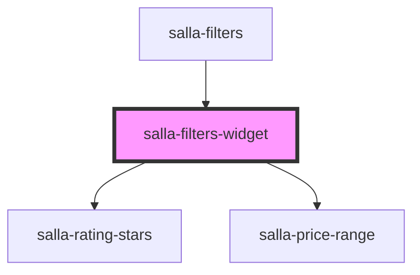

# salla-filters-widget

<!-- Auto Generated Below -->

## Properties

| Property       | Attribute        | Description                               | Type      | Default     |
| -------------- | ---------------- | ----------------------------------------- | --------- | ----------- |
| `filtersData`  | --               | Selected filter options value.            | `object`  | `undefined` |
| `option`       | --               | Filter option along with possible values. | `Filter`  | `undefined` |
| `withLoadMore` | `with-load-more` | Show more or less filter options.         | `boolean` | `undefined` |

## Events

| Event     | Description                                                 | Type               |
| --------- | ----------------------------------------------------------- | ------------------ |
| `changed` | Custom event emitted up on filter option selection changes. | `CustomEvent<any>` |

## Methods

### `reset() => Promise<void>`

Reset selected filter options.

#### Returns

Type: `Promise<void>`

### `setWidgetHeight(delay?: number) => Promise<void>`

#### Returns

Type: `Promise<void>`

### `showMore() => Promise<void>`

Action to show more or less filter options.

#### Returns

Type: `Promise<void>`

### `toggleWidget() => Promise<void>`

Action to toggle widget open or closed (expand/ collapse).

#### Returns

Type: `Promise<void>`

## Dependencies

### Used by

 - [salla-filters](../salla-filters)

### Depends on

- [salla-rating-stars](../salla-rating-stars)
- [salla-price-range](../salla-price-range)

### Graph

----------------------------------------------

*Built with [StencilJS](https://stenciljs.com/)*
