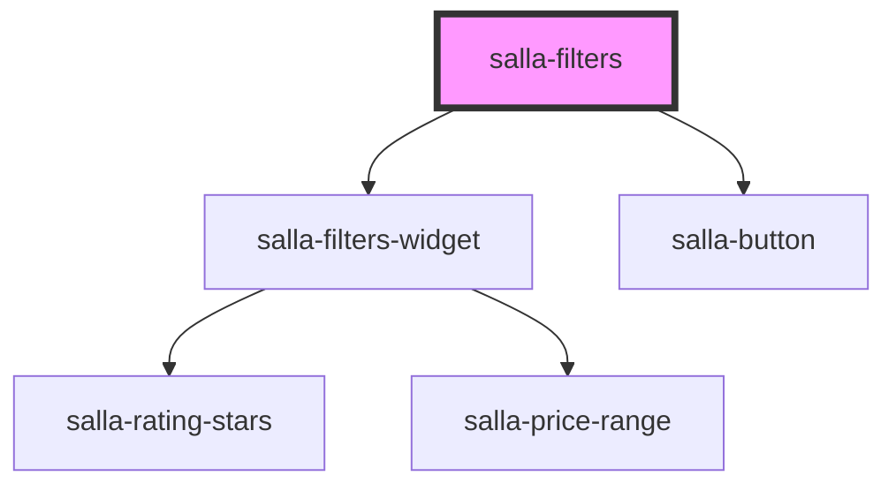

# salla-filters

<!-- Auto Generated Below -->

## Properties

| Property  | Attribute | Description             | Type       | Default     |
| --------- | --------- | ----------------------- | ---------- | ----------- |
| `filters` | --        | Array of filter options | `Filter[]` | `undefined` |

## Events

| Event     | Description                                               | Type               |
| --------- | --------------------------------------------------------- | ------------------ |
| `changed` | Custom event fired when the selected filters are changed. | `CustomEvent<any>` |

## Methods

### `applyFilters() => Promise<void>`

Apply filter action.

#### Returns

Type: `Promise<void>`

### `getFilters() => Promise<any>`

Method to get filter data.

#### Returns

Type: `Promise<any>`

### `resetFilters() => Promise<void>`

Reset selected filters.

#### Returns

Type: `Promise<void>`

## Dependencies

### Depends on

- [salla-filters-widget](../salla-filters-widget)
- [salla-button](../salla-button)

### Graph

----------------------------------------------

*Built with [StencilJS](https://stenciljs.com/)*
