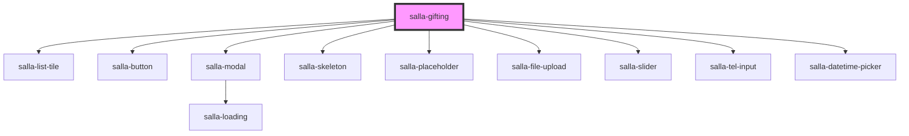

# salla-gifting

<!-- Auto Generated Below -->

## Properties

| Property         | Attribute         | Description                                              | Type     | Default     |
| ---------------- | ----------------- | -------------------------------------------------------- | -------- | ----------- |
| `productId`      | `product-id`      | The product id for which the gifting system is required. | `number` | `undefined` |
| `widgetSubtitle` | `widget-subtitle` | Widget subtitle                                          | `string` | `undefined` |
| `widgetTitle`    | `widget-title`    | Widget title                                             | `string` | `undefined` |

## Methods

### `close() => Promise<HTMLElement>`

Hide / close the gifting modal window

#### Returns

Type: `Promise<HTMLElement>`

### `goToStep2() => Promise<void>`

Go to the step 2

#### Returns

Type: `Promise<void>`

### `open() => Promise<any>`

Show / Open the gifting modal window

#### Returns

Type: `Promise<any>`

## Slots

| Slot                   | Description                              |
| ---------------------- | ---------------------------------------- |
| `"widget-btn-content"` | Used to customize widget button content. |

## Dependencies

### Depends on

- [salla-list-tile](../salla-list-tile)
- [salla-button](../salla-button)
- [salla-modal](../salla-modal)
- [salla-skeleton](../salla-skeleton)
- [salla-placeholder](../salla-placeholder)
- [salla-file-upload](../salla-file-upload)
- [salla-slider](../salla-slider)
- [salla-tel-input](../salla-tel-input)
- [salla-datetime-picker](../salla-datetime-picker)

### Graph

----------------------------------------------

*Built with [StencilJS](https://stenciljs.com/)*
