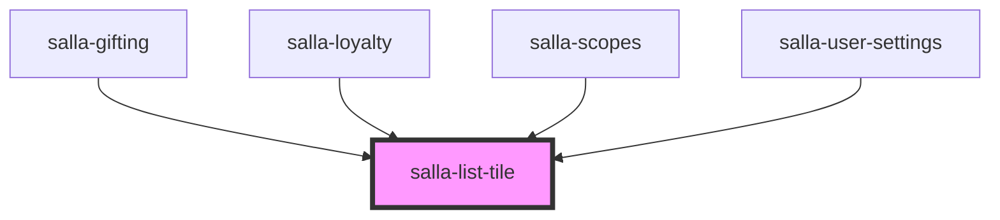

# salla-list-tile

<!-- Auto Generated Below -->

## Properties

| Property | Attribute | Description                                                                              | Type                                                        | Default     |
| -------- | --------- | ---------------------------------------------------------------------------------------- | ----------------------------------------------------------- | ----------- |
| `href`   | `href`    | Designates the component as anchor and applies the `href` attribute.                     | `string`                                                    | `undefined` |
| `target` | `target`  | Designates the target attribute. This should only be applied when using the `href` prop. | `"_blank" \| "_parent" \| "_self" \| "_top" \| "framename"` | `"_self"`   |

## Slots

| Slot         | Description                                   |
| ------------ | --------------------------------------------- |
| `"action"`   | An element to display after the title.        |
| `"icon"`     | An icon to display before the title.          |
| `"subtitle"` | Additional content displayed below the title. |
| `"title"`    | The primary content of the list tile.         |

## Dependencies

### Used by

 - [salla-gifting](../salla-gifting)
 - [salla-loyalty](../salla-loyalty)
 - [salla-scopes](../salla-scopes)
 - [salla-user-settings](../salla-user-settings)

### Graph

----------------------------------------------

*Built with [StencilJS](https://stenciljs.com/)*
