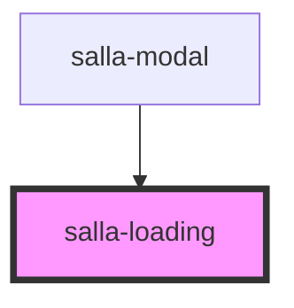

# salla-loading

<!-- Auto Generated Below -->

## Properties

| Property  | Attribute  | Description                                                       | Type               | Default     |
| --------- | ---------- | ----------------------------------------------------------------- | ------------------ | ----------- |
| `bgColor` | `bg-color` | Spinner background color.                                         | `string`           | `"#e5e7eb"` |
| `color`   | `color`    | Spinner content color.                                            | `string`           | `undefined` |
| `size`    | `size`     | Sets the diameter of the circle in pixels, Defaults to `32`       | `number \| string` | `32`        |
| `width`   | `width`    | Sets the stroke of the circle (border) in pixels, Defaults to `4` | `number \| string` | `2`         |

## Dependencies

### Used by

 - [salla-modal](../salla-modal)

### Graph

----------------------------------------------

*Built with [StencilJS](https://stenciljs.com/)*
