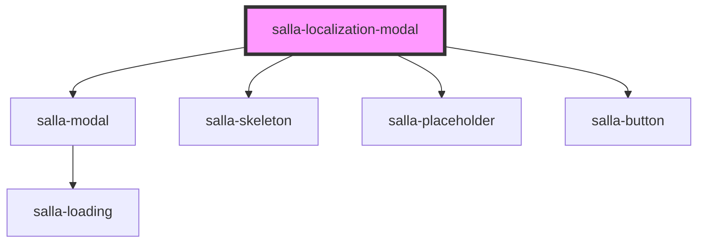

# salla-localization-modal

<!-- Auto Generated Below -->

## Properties

| Property   | Attribute  | Description                                   | Type     | Default                                  |
| ---------- | ---------- | --------------------------------------------- | -------- | ---------------------------------------- |
| `currency` | `currency` | Current currency (existing or newly selected) | `string` | `salla.config.get('user.currency_code')` |
| `language` | `language` | Current language (existing or newly selected) | `string` | `salla.config.get('user.language_code')` |

## Methods

### `close() => Promise<HTMLElement>`

Hide the component

#### Returns

Type: `Promise<HTMLElement>`

### `open() => Promise<any>`

open the component

#### Returns

Type: `Promise<any>`

### `submit() => Promise<void>`

Change currency and language to the selected ones.

#### Returns

Type: `Promise<void>`

## Slots

| Slot         | Description                                                                          |
| ------------ | ------------------------------------------------------------------------------------ |
| `"currency"` | Replaces currency label, has replaceable props `{name}`, `{code}`, `{country_code}`. |
| `"footer"`   | Replaces the bottom button.                                                          |
| `"header"`   | The top of the modal.                                                                |
| `"language"` | Replaces language label, has replaceable props `{name}`, `{code}`, `{country_code}`. |

## Dependencies

### Depends on

- [salla-modal](../salla-modal)
- [salla-skeleton](../salla-skeleton)
- [salla-placeholder](../salla-placeholder)
- [salla-button](../salla-button)

### Graph

----------------------------------------------

*Built with [StencilJS](https://stenciljs.com/)*
