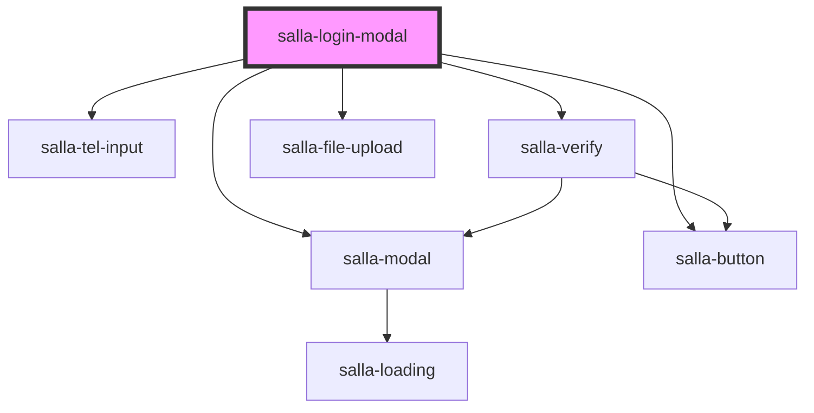

# salla-login-modal

<!-- Auto Generated Below -->

## Properties

| Property          | Attribute           | Description                                                                                                   | Type      | Default     |
| ----------------- | ------------------- | ------------------------------------------------------------------------------------------------------------- | --------- | ----------- |
| `isEmailAllowed`  | `is-email-allowed`  | Does the merchant allow to login using email                                                                  | `boolean` | `undefined` |
| `isEmailRequired` | `is-email-required` | Does the merchant require registration with email & mobile                                                    | `boolean` | `false`     |
| `isMobileAllowed` | `is-mobile-allowed` | Does the merchant/current location for visitor allow to login using mobile, By default outside KSA is `false` | `boolean` | `true`      |
| `supportWebAuth`  | `support-web-auth`  | Once the api verify success, it will be login the customer in web pages                                       | `boolean` | `true`      |

## Methods

### `open(event?: any) => Promise<HTMLElement>`

Open login component

#### Returns

Type: `Promise<HTMLElement>`

## Slots

| Slot                    | Description          |
| ----------------------- | -------------------- |
| `"after-login-email"`   | placeholder position |
| `"after-login-mobile"`  | placeholder position |
| `"after-login-type"`    | placeholder position |
| `"after-registration"`  | placeholder position |
| `"before-login-email"`  | placeholder position |
| `"before-login-mobile"` | placeholder position |
| `"before-login-type"`   | placeholder position |
| `"before-registration"` | placeholder position |
| `"footer"`              | The footer of modal  |

## Dependencies

### Depends on

- [salla-modal](../salla-modal)
- [salla-tel-input](../salla-tel-input)
- [salla-button](../salla-button)
- [salla-verify](../salla-verify)
- [salla-file-upload](../salla-file-upload)

### Graph

----------------------------------------------

*Built with [StencilJS](https://stenciljs.com/)*
