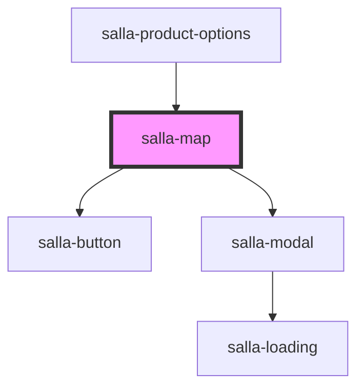

# salla-map

<!-- Auto Generated Below -->

## Properties

| Property     | Attribute     | Description                                             | Type      | Default      |
| ------------ | ------------- | ------------------------------------------------------- | --------- | ------------ |
| `apiKey`     | `api-key`     | Sets google api key value, default Merchant key         | `string`  | `undefined`  |
| `lat`        | `lat`         | Latitude coordinate, defaults to current user location  | `number`  | `undefined`  |
| `lng`        | `lng`         | Longitude coordinate, defaults to current user location | `number`  | `undefined`  |
| `modalTitle` | `modal-title` | Modal Title                                             | `string`  | `undefined`  |
| `name`       | `name`        | File input name for the native formData                 | `string`  | `'location'` |
| `readonly`   | `readonly`    | Disable or enable actions                               | `boolean` | `false`      |
| `required`   | `required`    | Set if the location input is required or not            | `boolean` | `false`      |
| `searchable` | `searchable`  | Sets the search bar visibility.                         | `boolean` | `false`      |
| `theme`      | `theme`       | Sets map style.                                         | `string`  | `'light'`    |
| `zoom`       | `zoom`        | Sets start map zoom.                                    | `number`  | `10`         |

## Events

| Event                    | Description                                                | Type               |
| ------------------------ | ---------------------------------------------------------- | ------------------ |
| `currentLocationChanged` | Custom DOM event emitter when current location is selected | `CustomEvent<any>` |
| `invalidInput`           | Event emitted when the input is invalid.                   | `CustomEvent<any>` |
| `mapClicked`             | Custom DOM event emitter when map is clicked               | `CustomEvent<any>` |
| `selected`               | Custom DOM event emitter when location is selected         | `CustomEvent<any>` |

## Methods

### `open() => Promise<HTMLElement>`

Open location component

#### Returns

Type: `Promise<HTMLElement>`

## Dependencies

### Used by

 - [salla-product-options](../salla-product-options)

### Depends on

- [salla-button](../salla-button)
- [salla-modal](../salla-modal)

### Graph

----------------------------------------------

*Built with [StencilJS](https://stenciljs.com/)*
