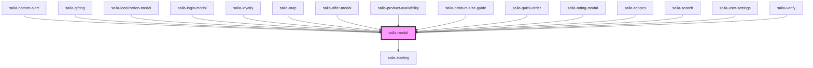

# salla-modal

<!-- Auto Generated Below -->

## Properties

| Property        | Attribute         | Description                                                                  | Type                                             | Default     |
| --------------- | ----------------- | ---------------------------------------------------------------------------- | ------------------------------------------------ | ----------- |
| `centered`      | `centered`        | Align modal content to center, defaults to `false`                           | `boolean`                                        | `false`     |
| `hasSkeleton`   | `has-skeleton`    | open the modal on rendering                                                  | `boolean`                                        | `false`     |
| `iconStyle`     | `icon-style`      | Set the style of the header icon.                                            | `"error" \| "normal" \| "primary" \| "success"`  | `undefined` |
| `isClosable`    | `is-closable`     | Sets the modal to be closable. Defaults to `true`                            | `boolean`                                        | `true`      |
| `isLoading`     | `is-loading`      | Show loading in the middle                                                   | `boolean`                                        | `false`     |
| `noPadding`     | `no-padding`      | Avoid padding in the modal body or not, defaults to `false`                  | `boolean`                                        | `false`     |
| `position`      | `position`        | The position of the modal                                                    | `"bottom" \| "middle" \| "top"`                  | `'middle'`  |
| `subTitle`      | `sub-title`       | Set modal sub title.                                                         | `string`                                         | `''`        |
| `subTitleFirst` | `sub-title-first` | Show subtitle before the title or not, defaults to `false` (after the title) | `boolean`                                        | `false`     |
| `visible`       | `visible`         | open the modal on rendering                                                  | `boolean`                                        | `false`     |
| `width`         | `width`           | The size of the modal                                                        | `"full" \| "lg" \| "md" \| "sm" \| "xl" \| "xs"` | `'md'`      |

## Events

| Event                    | Description                                        | Type                   |
| ------------------------ | -------------------------------------------------- | ---------------------- |
| `modalVisibilityChanged` | Event emitted when the modal visibilty is changed. | `CustomEvent<Boolean>` |

## Methods

### `close() => Promise<HTMLElement>`

close the modal

#### Returns

Type: `Promise<HTMLElement>`

### `loading() => Promise<HTMLElement>`

Start loading

#### Returns

Type: `Promise<HTMLElement>`

### `open() => Promise<HTMLElement>`

Open the modal

#### Returns

Type: `Promise<HTMLElement>`

### `setTitle(modalTitle: any) => Promise<HTMLElement>`

Change the Modal Title

#### Returns

Type: `Promise<HTMLElement>`

### `stopLoading() => Promise<HTMLElement>`

Stop the loading

#### Returns

Type: `Promise<HTMLElement>`

## Slots

| Slot       | Description         |
| ---------- | ------------------- |
| `"footer"` | The footer of modal |

## Dependencies

### Used by

 - [salla-bottom-alert](../salla-bottom-alert)
 - [salla-gifting](../salla-gifting)
 - [salla-localization-modal](../salla-localization-modal)
 - [salla-login-modal](../salla-login-modal)
 - [salla-loyalty](../salla-loyalty)
 - [salla-map](../salla-map)
 - [salla-offer-modal](../salla-offer-modal)
 - [salla-product-availability](../salla-product-availability)
 - [salla-product-size-guide](../salla-product-size-guide)
 - [salla-quick-order](../salla-quick-order)
 - [salla-rating-modal](../salla-rating-modal)
 - [salla-scopes](../salla-scopes)
 - [salla-search](../salla-search)
 - [salla-user-settings](../salla-user-settings)
 - [salla-verify](../salla-verify)

### Depends on

- [salla-loading](../salla-loading)

### Graph

----------------------------------------------

*Built with [StencilJS](https://stenciljs.com/)*
