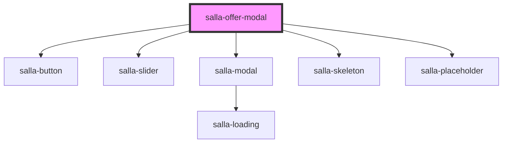

# salla-offer-modal

<!-- Auto Generated Below -->

## Methods

### `open(product_id: number) => Promise<any>`

Show the available offers for the product

#### Returns

Type: `Promise<any>`

### `showOffer(offer: any) => Promise<void>`

Show offer details

#### Returns

Type: `Promise<void>`

## Slots

| Slot         | Description                                                                           |
| ------------ | ------------------------------------------------------------------------------------- |
| `"category"` | Replaces Category badge, has replaceable props `{name}`, `{url}`.                     |
| `"header"`   | The top of the popup, has replaceable props `{name}`, `{message}`.                    |
| `"product"`  | Replaces product card, has replaceable props `{name}`, `{url}`, `{image}`, `{price}`. |

## Dependencies

### Depends on

- [salla-button](../salla-button)
- [salla-slider](../salla-slider)
- [salla-modal](../salla-modal)
- [salla-skeleton](../salla-skeleton)
- [salla-placeholder](../salla-placeholder)

### Graph

----------------------------------------------

*Built with [StencilJS](https://stenciljs.com/)*
