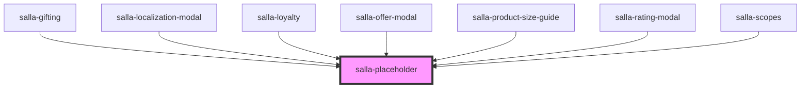

# salla-placeholder

<!-- Auto Generated Below -->

## Properties

| Property    | Attribute   | Description                                                                                               | Type                                                      | Default  |
| ----------- | ----------- | --------------------------------------------------------------------------------------------------------- | --------------------------------------------------------- | -------- |
| `alignment` | `alignment` | Defines the alignment of contents. Defaults to [`left`]                                                   | `"center" \| "left" \| "right"`                           | `'left'` |
| `icon`      | `icon`      | Custom icon to display, defaults to [`Inbox`], can be any valid svg icon or inline element with font icon | `string`                                                  | `Inbox`  |
| `iconSize`  | `icon-size` | The size of the icon. Defaults to [`md`] = 45px for font icon & width/height: 3.5rem for svg icon         | `"lg" \| "md" \| "sm" \| "xl" \| "xs" \| "xxl" \| "xxxl"` | `'md'`   |

## Slots

| Slot            | Description                                   |
| --------------- | --------------------------------------------- |
| `"description"` | Additional content displayed below the title. |
| `"title"`       | The primary content of the placeholder.       |

## Dependencies

### Used by

 - [salla-gifting](../salla-gifting)
 - [salla-localization-modal](../salla-localization-modal)
 - [salla-loyalty](../salla-loyalty)
 - [salla-offer-modal](../salla-offer-modal)
 - [salla-product-size-guide](../salla-product-size-guide)
 - [salla-rating-modal](../salla-rating-modal)
 - [salla-scopes](../salla-scopes)

### Graph

----------------------------------------------

*Built with [StencilJS](https://stenciljs.com/)*
