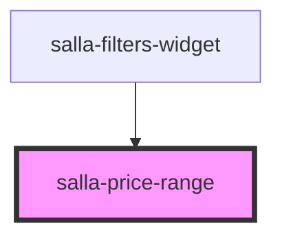

# salla-price-range

<!-- Auto Generated Below -->

## Properties

| Property      | Attribute      | Description                                       | Type     | Default     |
| ------------- | -------------- | ------------------------------------------------- | -------- | ----------- |
| `filtersData` | `filters-data` | Currently selected price filter data              | `any`    | `undefined` |
| `maxPrice`    | `max-price`    | Maximum price threshold value                     | `any`    | `undefined` |
| `minPrice`    | `min-price`    | Minimum price threshold value                     | `any`    | `undefined` |
| `option`      | --             | Product price range filter option object instance | `Filter` | `undefined` |

## Events

| Event     | Description                                                  | Type               |
| --------- | ------------------------------------------------------------ | ------------------ |
| `changed` | Custome event emitted when there is a change in price input. | `CustomEvent<any>` |

## Methods

### `reset() => Promise<void>`

reset the price range inputs

#### Returns

Type: `Promise<void>`

## Dependencies

### Used by

 - [salla-filters-widget](../salla-filters-widget)

### Graph

----------------------------------------------

*Built with [StencilJS](https://stenciljs.com/)*
