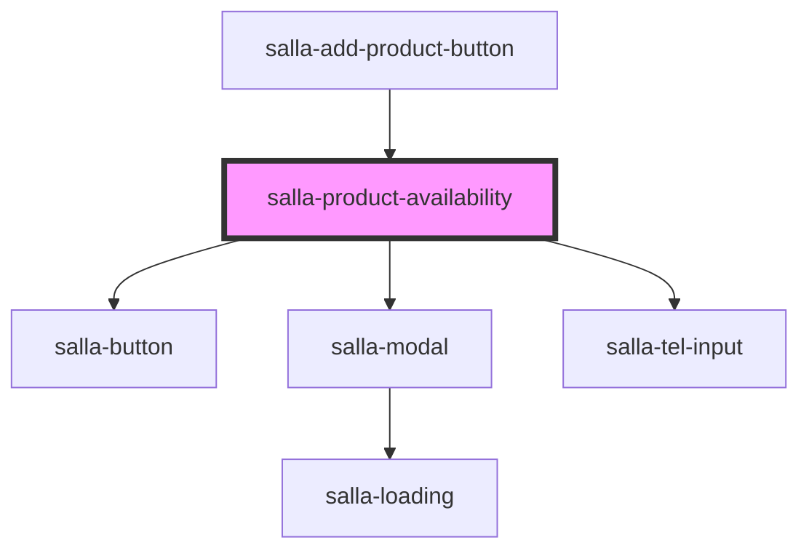

# salla-product-availability

<!-- Auto Generated Below -->

## Properties

| Property                    | Attribute                     | Description                                                            | Type                              | Default     |
| --------------------------- | ----------------------------- | ---------------------------------------------------------------------- | --------------------------------- | ----------- |
| `channels`                  | `channels`                    | Notification channels                                                  | `"email" \| "sms" \| "sms,email"` | `undefined` |
| `isSubscribed`              | `is-subscribed`               | is current user already subscribed                                     | `boolean`                         | `false`     |
| `notifyOptionsAvailability` | `notify-options-availability` | Listen to product options availability.                                | `boolean`                         | `false`     |
| `productId`                 | `product-id`                  | product id that can visitor subscribe to its availability notification | `number`                          | `undefined` |

## Dependencies

### Used by

 - [salla-add-product-button](../salla-add-product-button)

### Depends on

- [salla-button](../salla-button)
- [salla-modal](../salla-modal)
- [salla-tel-input](../salla-tel-input)

### Graph

----------------------------------------------

*Built with [StencilJS](https://stenciljs.com/)*
