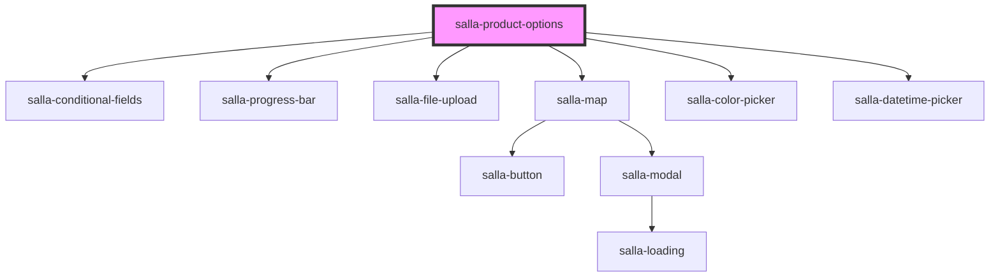

# salla-product-options

<!-- Auto Generated Below -->

## Properties

| Property    | Attribute    | Description                                                             | Type     | Default                       |
| ----------- | ------------ | ----------------------------------------------------------------------- | -------- | ----------------------------- |
| `options`   | `options`    | Product detail information.                                             | `string` | `undefined`                   |
| `productId` | `product-id` | The id of the product to which the options are going to be fetched for. | `number` | `salla.config.get('page.id')` |

## Events

| Event     | Description                                       | Type               |
| --------- | ------------------------------------------------- | ------------------ |
| `changed` | An event that emitted when any option is changed. | `CustomEvent<any>` |

## Methods

### `getOption(option_id: any) => Promise<Option>`

Get a specific option by its id.

#### Returns

Type: `Promise<Option>`

### `getSelectedOptions() => Promise<any[]>`

Get selected options.

#### Returns

Type: `Promise<any[]>`

### `getSelectedOptionsData() => Promise<{}>`

Get the id's of the selected options.

#### Returns

Type: `Promise<{}>`

### `hasOutOfStockOption() => Promise<boolean>`

Return true if there is any out of stock options are selected and vise versa.

#### Returns

Type: `Promise<boolean>`

### `reportValidity() => Promise<boolean>`

Report options form validity.

#### Returns

Type: `Promise<boolean>`

## Dependencies

### Depends on

- [salla-conditional-fields](../salla-conditional-fields)
- [salla-progress-bar](../salla-progress-bar)
- [salla-file-upload](../salla-file-upload)
- [salla-map](../salla-map)
- [salla-color-picker](../salla-color-picker)
- [salla-datetime-picker](../salla-datetime-picker)

### Graph

----------------------------------------------

*Built with [StencilJS](https://stenciljs.com/)*
