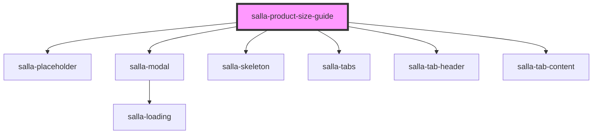

# salla-product-size-guide

<!-- Auto Generated Below -->

## Methods

### `close() => Promise<HTMLElement>`

Hide the size-guide modal window

#### Returns

Type: `Promise<HTMLElement>`

### `open(product_id: number) => Promise<any>`

Show the size-guide modal window

#### Returns

Type: `Promise<any>`

## Slots

| Slot       | Description                                           |
| ---------- | ----------------------------------------------------- |
| `"footer"` | The bottom section of the component.Empty by default. |
| `"header"` | The upper section of the component.Empty by default.  |

## Dependencies

### Depends on

- [salla-placeholder](../salla-placeholder)
- [salla-modal](../salla-modal)
- [salla-skeleton](../salla-skeleton)
- [salla-tabs](../salla-tabs)
- [salla-tab-header](../salla-tabs)
- [salla-tab-content](../salla-tabs)

### Graph

----------------------------------------------

*Built with [StencilJS](https://stenciljs.com/)*
