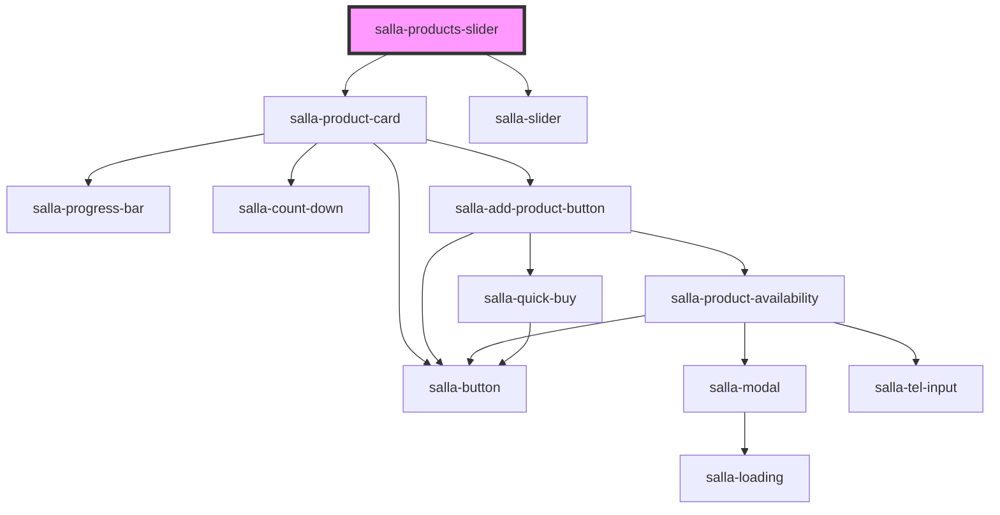

# salla-products-slider

<!-- Auto Generated Below -->

## Properties

| Property        | Attribute         | Description                                                                                                                                                                                                             | Type                                                                                                                | Default     |
| --------------- | ----------------- | ----------------------------------------------------------------------------------------------------------------------------------------------------------------------------------------------------------------------- | ------------------------------------------------------------------------------------------------------------------- | ----------- |
| `autoplay`      | `autoplay`        | autoplay option for products slider                                                                                                                                                                                     | `boolean`                                                                                                           | `undefined` |
| `blockTitle`    | `block-title`     | Title of the block - works only if slider is true                                                                                                                                                                       | `string`                                                                                                            | `undefined` |
| `displayAllUrl` | `display-all-url` | Display 'ALL' URL                                                                                                                                                                                                       | `string`                                                                                                            | `undefined` |
| `limit`         | `limit`           | Limit for number of products in the list.                                                                                                                                                                               | `number`                                                                                                            | `undefined` |
| `sliderId`      | `slider-id`       | Slider Id, if not provided will be generated automatically                                                                                                                                                              | `string`                                                                                                            | `undefined` |
| `source`        | `source`          | Source of the products, if api will get the products from the API, if json will get the products from the products prop                                                                                                 | `"brands" \| "categories" \| "json" \| "landing-page" \| "latest" \| "offers" \| "related" \| "selected" \| "tags"` | `undefined` |
| `sourceValue`   | `source-value`    | The source value, cloud be different values as following: - array of ids when `source` in ['categories', 'brands', 'tags', 'selected'] - products payload when `source` = 'json' - product_id when `source` = 'related' | `string`                                                                                                            | `undefined` |
| `subTitle`      | `sub-title`       | Sub title of the block - works only if slider is true                                                                                                                                                                   | `string`                                                                                                            | `undefined` |

## Dependencies

### Depends on

- [salla-product-card](../salla-product-card)
- [salla-slider](../salla-slider)

### Graph

----------------------------------------------

*Built with [StencilJS](https://stenciljs.com/)*
