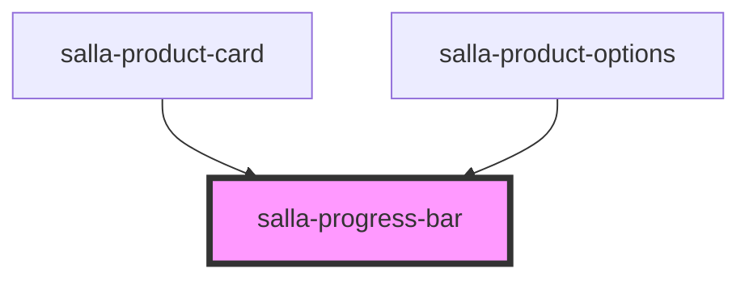

# salla-progress-bar

<!-- Auto Generated Below -->

## Properties

| Property   | Attribute  | Description                                                                                                                                                                                        | Type                 | Default     |
| ---------- | ---------- | -------------------------------------------------------------------------------------------------------------------------------------------------------------------------------------------------- | -------------------- | ----------- |
| `color`    | `color`    | Progress bar color, defaults to: `salla.config.get('theme.color.primary', "#ffd5c4")`                                                                                                              | `string`             | `undefined` |
| `donation` | `donation` | You can just pass the donation as json string ex: `{"target_message":null,"target_date":"2023-04-18","target_end_date":"2023-04-18","target_amount":400,"collected_amount":380,"can_donate":true}` | `Donation \| string` | `undefined` |
| `header`   | `header`   | Big Title, before the progress bar.                                                                                                                                                                | `string`             | `undefined` |
| `height`   | `height`   | Set height for the wrapper.                                                                                                                                                                        | `string`             | `"10px"`    |
| `message`  | `message`  | Subtitle under the progress bar or instead of it if the target not being set.                                                                                                                      | `string`             | `undefined` |
| `stripped` | `stripped` | Stripped effect for tje progress bar.                                                                                                                                                              | `boolean`            | `undefined` |
| `target`   | `target`   | The goal of the progress bar                                                                                                                                                                       | `number`             | `undefined` |
| `unit`     | `unit`     | The unite to be added after the numbers, defaults to: `salla.config.currency().symbol`                                                                                                             | `string`             | `undefined` |
| `value`    | `value`    | The progress so far as of the goal.                                                                                                                                                                | `number`             | `undefined` |

## Dependencies

### Used by

 - [salla-product-card](../salla-product-card)
 - [salla-product-options](../salla-product-options)

### Graph

----------------------------------------------

*Built with [StencilJS](https://stenciljs.com/)*
