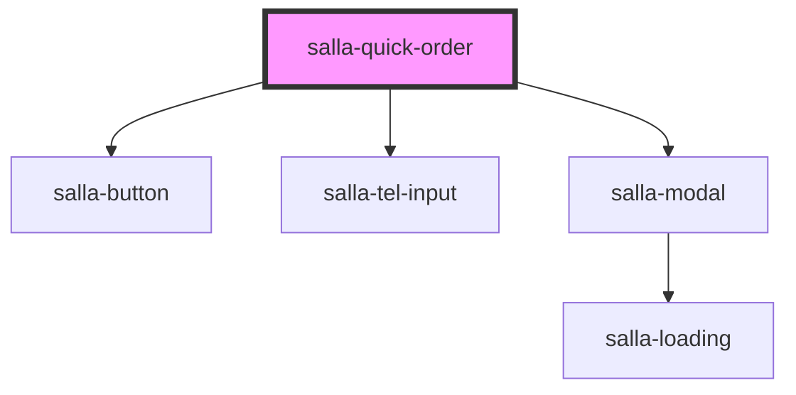

# salla-quick-order

<!-- Auto Generated Below -->

## Properties

| Property                | Attribute                  | Description                              | Type                             | Default                                                        |
| ----------------------- | -------------------------- | ---------------------------------------- | -------------------------------- | -------------------------------------------------------------- |
| `agreementText`         | `agreement-text`           | agreement text from server or from props | `string`                         | `salla.lang.get(     'pages.checkout.show_full_agreement'   )` |
| `confirmPayButtonTitle` | `confirm-pay-button-title` | quick order confirm pay button text      | `string`                         | `'اشتر الآن'`                                                  |
| `isEmailRequired`       | `is-email-required`        | is email required                        | `boolean`                        | `false`                                                        |
| `payButtonTitle`        | `pay-button-title`         | quick order pay button text              | `string`                         | `'اطلب المنتج'`                                                |
| `productId`             | `product-id`               | product id local or from page            | `string`                         | `undefined`                                                    |
| `quickOrderStyle`       | `quick-order-style`        | Quick Order Style                        | `"default" \| "gray" \| "white"` | `'default'`                                                    |
| `quickOrderTitle`       | `quick-order-title`        | quick order title                        | `string`                         | `'ليش تنتظر؟'`                                                 |
| `subTitle`              | `sub-title`                | quick order sub title                    | `string`                         | `'احصل على المنتج مباشرة الآن'`                                |
| `thanksMessage`         | `thanks-message`           | product id local or from page            | `string`                         | `undefined`                                                    |

## Events

| Event                | Description                                                       | Type               |
| -------------------- | ----------------------------------------------------------------- | ------------------ |
| `quickOrderSubmited` | Custome DOM event emitter when order gets submitted successfully. | `CustomEvent<any>` |

## Dependencies

### Depends on

- [salla-button](../salla-button)
- [salla-tel-input](../salla-tel-input)
- [salla-modal](../salla-modal)

### Graph

----------------------------------------------

*Built with [StencilJS](https://stenciljs.com/)*
