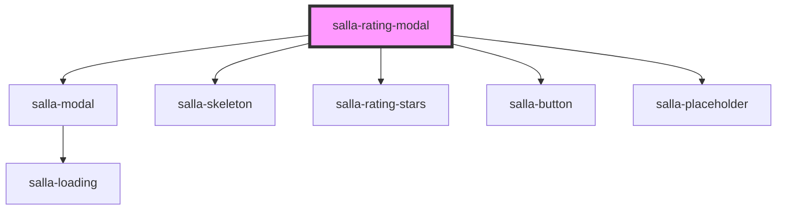

# salla-rating-modal

<!-- Auto Generated Below -->

## Properties

| Property  | Attribute  | Description                                      | Type     | Default                       |
| --------- | ---------- | ------------------------------------------------ | -------- | ----------------------------- |
| `orderId` | `order-id` | The order id, to rate on its products & shipping | `number` | `salla.config.get('page.id')` |

## Methods

### `close() => Promise<HTMLElement>`

Show the rating modal

#### Returns

Type: `Promise<HTMLElement>`

### `open() => Promise<void | NodeJS.Timeout>`

Show the rating modal

#### Returns

Type: `Promise<void | Timeout>`

## Dependencies

### Depends on

- [salla-modal](../salla-modal)
- [salla-skeleton](../salla-skeleton)
- [salla-rating-stars](../salla-rating-stars)
- [salla-button](../salla-button)
- [salla-placeholder](../salla-placeholder)

### Graph

----------------------------------------------

*Built with [StencilJS](https://stenciljs.com/)*
