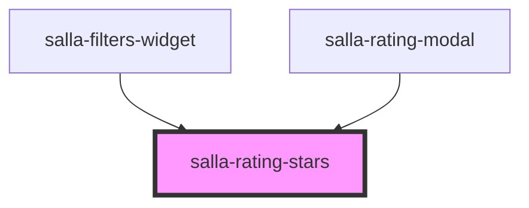

# salla-rating-stars

<!-- Auto Generated Below -->

## Properties

| Property  | Attribute | Description                                                     | Type                                       | Default     |
| --------- | --------- | --------------------------------------------------------------- | ------------------------------------------ | ----------- |
| `name`    | `name`    | Sets input name.                                                | `string`                                   | `'rating'`  |
| `reviews` | `reviews` | Number of reviews to display.                                   | `number`                                   | `0`         |
| `size`    | `size`    | Sets the height and width of the component. Defaults to medium. | `"large" \| "medium" \| "mini" \| "small"` | `'medium'`  |
| `value`   | `value`   | The rating value.                                               | `number`                                   | `undefined` |

## Dependencies

### Used by

 - [salla-filters-widget](../salla-filters-widget)
 - [salla-rating-modal](../salla-rating-modal)

### Graph

----------------------------------------------

*Built with [StencilJS](https://stenciljs.com/)*
