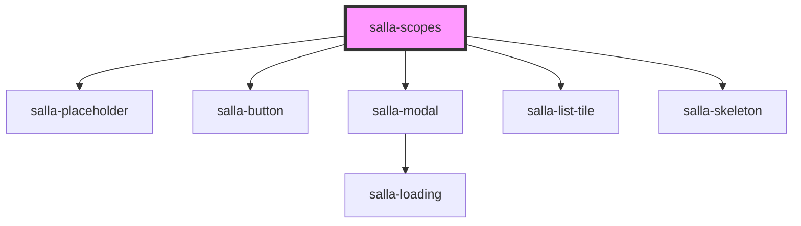

# salla-scopes

<!-- Auto Generated Below -->

## Properties

| Property             | Attribute              | Description                                                   | Type                        | Default      |
| -------------------- | ---------------------- | ------------------------------------------------------------- | --------------------------- | ------------ |
| `searchDisplayLimit` | `search-display-limit` | Dictates when to show the search field                        | `number`                    | `6`          |
| `selection`          | `selection`            | Optionally open the modal or enforce the pop-up to the viewer | `"mandatory" \| "optional"` | `'optional'` |

## Methods

### `close() => Promise<HTMLElement>`

Closes the scope modal.

#### Returns

Type: `Promise<HTMLElement>`

### `handleSubmit() => Promise<any>`

Submit form to change exsiting scope.

#### Returns

Type: `Promise<any>`

### `open(mode?: any, product_id?: number) => Promise<any>`

Opens the scope modal.

#### Returns

Type: `Promise<any>`

## Slots

| Slot       | Description                                                                                                       |
| ---------- | ----------------------------------------------------------------------------------------------------------------- |
| `"footer"` | The bottom section of the component, used for form action. Utilizes the `handleSubmit` method to submit the form. |

## Dependencies

### Depends on

- [salla-placeholder](../salla-placeholder)
- [salla-button](../salla-button)
- [salla-modal](../salla-modal)
- [salla-list-tile](../salla-list-tile)
- [salla-skeleton](../salla-skeleton)

### Graph

----------------------------------------------

*Built with [StencilJS](https://stenciljs.com/)*
