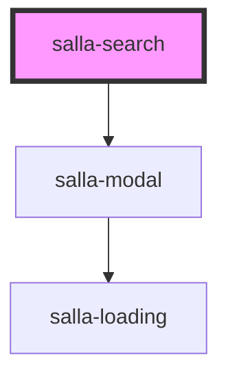

# salla-search

<!-- Auto Generated Below -->

## Properties

| Property | Attribute | Description                                                         | Type      | Default |
| -------- | --------- | ------------------------------------------------------------------- | --------- | ------- |
| `height` | `height`  | Sets the height of the input                                        | `number`  | `60`    |
| `inline` | `inline`  | Set the component display without modal window. Defaults to `false` | `boolean` | `false` |
| `oval`   | `oval`    | Adds a border radius to the input. Half of the height.              | `boolean` | `false` |

## Slots

| Slot        | Description                                                                                                     |
| ----------- | --------------------------------------------------------------------------------------------------------------- |
| `"product"` | Replaces products card in the results, has replaceable props `{name}`, `{price}`, `{regular_price}`, `{image}`. |

## Dependencies

### Depends on

- [salla-modal](../salla-modal)

### Graph

----------------------------------------------

*Built with [StencilJS](https://stenciljs.com/)*
