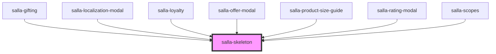

# salla-skeleton

<!-- Auto Generated Below -->

## Properties

| Property | Attribute | Description                                               | Type                   | Default    |
| -------- | --------- | --------------------------------------------------------- | ---------------------- | ---------- |
| `height` | `height`  | Set the skeleton height                                   | `string`               | `'100%'`   |
| `type`   | `type`    | Set the shape type of the skeleton is it circle or normal | `"circle" \| "normal"` | `'normal'` |
| `width`  | `width`   | Set the skeleton width                                    | `string`               | `'100%'`   |

## Dependencies

### Used by

 - [salla-gifting](../salla-gifting)
 - [salla-localization-modal](../salla-localization-modal)
 - [salla-loyalty](../salla-loyalty)
 - [salla-offer-modal](../salla-offer-modal)
 - [salla-product-size-guide](../salla-product-size-guide)
 - [salla-rating-modal](../salla-rating-modal)
 - [salla-scopes](../salla-scopes)

### Graph

----------------------------------------------

*Built with [StencilJS](https://stenciljs.com/)*
