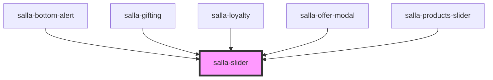

# salla-slider

<!-- Auto Generated Below -->

## Properties

| Property                   | Attribute                     | Description                                                                                                                                                                          | Type                                                                                                             | Default     |
| -------------------------- | ----------------------------- | ------------------------------------------------------------------------------------------------------------------------------------------------------------------------------------ | ---------------------------------------------------------------------------------------------------------------- | ----------- |
| `arrowsCentered`           | `arrows-centered`             | Show/hide display all button beside arrows                                                                                                                                           | `boolean`                                                                                                        | `false`     |
| `autoHeight`               | `auto-height`                 | Auto Height slider                                                                                                                                                                   | `boolean`                                                                                                        | `false`     |
| `autoPlay`                 | `auto-play`                   | Enable autoplay  - working with `type="carousel" only`                                                                                                                               | `boolean`                                                                                                        | `false`     |
| `blockSubtitle`            | `block-subtitle`              | Show/hide slider block sub title                                                                                                                                                     | `string`                                                                                                         | `''`        |
| `blockTitle`               | `block-title`                 | Show/hide slider block title                                                                                                                                                         | `string`                                                                                                         | `''`        |
| `centered`                 | `centered`                    | Enable center mode  - working with `type="carousel" only`                                                                                                                            | `boolean`                                                                                                        | `false`     |
| `controlsOuter`            | `controls-outer`              | Show/hide arrows                                                                                                                                                                     | `boolean`                                                                                                        | `false`     |
| `direction`                | `direction`                   | Slider direction. Default: document.documentElement.dir                                                                                                                              | `string`                                                                                                         | `undefined` |
| `displayAllUrl`            | `display-all-url`             | Show/hide display all button beside arrows                                                                                                                                           | `string`                                                                                                         | `''`        |
| `gridThumbs`               | `grid-thumbs`                 | Disable thumbs slider and show it as a grid                                                                                                                                          | `boolean`                                                                                                        | `false`     |
| `listenToThumbnailsOption` | `listen-to-thumbnails-option` | Enable call a specific slide by index from thumbnails option in `salla-slider-options` component, works only if `data-img-id` and `data-slid-index` attributes are set on each slide | `boolean`                                                                                                        | `false`     |
| `loop`                     | `loop`                        | Run slider in loop, Don't use it for slides with custom components inside it, because it may cause re-render issue                                                                   | `boolean`                                                                                                        | `false`     |
| `pagination`               | `pagination`                  | Enable pagination                                                                                                                                                                    | `boolean`                                                                                                        | `false`     |
| `showControls`             | `show-controls`               | Show/hide arrows                                                                                                                                                                     | `boolean`                                                                                                        | `true`      |
| `showThumbsControls`       | `show-thumbs-controls`        | Show/hide thumbs slider arrows                                                                                                                                                       | `boolean`                                                                                                        | `true`      |
| `sliderConfig`             | `slider-config`               | Slider Configs refer to https://swiperjs.com/swiper-api#parameters and pass the entire config object                                                                                 | `any`                                                                                                            | `undefined` |
| `slidesPerView`            | `slides-per-view`             | slidesPerView                                                                                                                                                                        | `string`                                                                                                         | `"auto"`    |
| `thumbsConfig`             | `thumbs-config`               | Thumbs Slider Configs refer to https://swiperjs.com/swiper-api#parameters and pass the entire config object                                                                          | `any`                                                                                                            | `undefined` |
| `type`                     | `type`                        | Set the type of the slider Default: ''                                                                                                                                               | `"" \| "blog" \| "carousel" \| "default" \| "fullscreen" \| "fullwidth" \| "hero" \| "testimonials" \| "thumbs"` | `''`        |
| `vertical`                 | `vertical`                    | Vertical or Horizontal main slider                                                                                                                                                   | `boolean`                                                                                                        | `false`     |
| `verticalThumbs`           | `vertical-thumbs`             | Vertical or Horizontal thumbs slider                                                                                                                                                 | `boolean`                                                                                                        | `false`     |

## Events

| Event                        | Description                                                                                                            | Type               |
| ---------------------------- | ---------------------------------------------------------------------------------------------------------------------- | ------------------ |
| `afterInit`                  | Event will fired right after initialization.                                                                           | `CustomEvent<any>` |
| `reachBeginning`             | Event will be fired when Swiper reach its beginning (initial position)                                                 | `CustomEvent<any>` |
| `reachEnd`                   | Event will be fired when Swiper reach last slide                                                                       | `CustomEvent<any>` |
| `slideChange`                | Event will be fired when currently active slide is changed                                                             | `CustomEvent<any>` |
| `slideChangeTransitionEnd`   | Event will be fired after animation to other slide (next or previous).                                                 | `CustomEvent<any>` |
| `slideChangeTransitionStart` | Event will be fired in the beginning of animation to other slide (next or previous).                                   | `CustomEvent<any>` |
| `slideNextTransitionEnd`     | Same as "slideChangeTransitionEnd" but for "forward" direction only                                                    | `CustomEvent<any>` |
| `slideNextTransitionStart`   | Same as "slideChangeTransitionStart" but for "forward" direction only                                                  | `CustomEvent<any>` |
| `slidePrevTransitionEnd`     | Same as "slideChangeTransitionEnd" but for "backward" direction only                                                   | `CustomEvent<any>` |
| `slidePrevTransitionStart`   | Same as "slideChangeTransitionStart" but for "backward" direction only                                                 | `CustomEvent<any>` |
| `sliderMove`                 | Event will be fired when user touch and move finger over Swiper and move it. Receives touchmove event as an arguments. | `CustomEvent<any>` |
| `sliderTransitionEnd`        | Event will be fired after transition.                                                                                  | `CustomEvent<any>` |
| `sliderTransitionStart`      | Event will be fired in the beginning of transition.                                                                    | `CustomEvent<any>` |
| `touchSliderEnd`             | Event will be fired when user release Swiper. Receives touchend event as an arguments.                                 | `CustomEvent<any>` |
| `touchSliderMove`            | Event will be fired when user touch and move finger over Swiper. Receives touchmove event as an arguments.             | `CustomEvent<any>` |
| `touchSliderStart`           | Event will be fired when user touch Swiper. Receives touchstart event as an arguments.                                 | `CustomEvent<any>` |

## Methods

### `getSlides() => Promise<any>`

Get slider slides
*

#### Returns

Type: `Promise<any>`

### `slideNext(speed?: number, runCallbacks?: boolean) => Promise<void>`

Run transition to the next slide.

#### Returns

Type: `Promise<void>`

### `slideNextLoop(speed?: number, runCallbacks?: boolean) => Promise<void>`

Does the same as .slideNext but for the case when used with enabled loop. So this method will slide to next slide with realIndex matching to next index

#### Returns

Type: `Promise<void>`

### `slidePrev(speed?: number, runCallbacks?: boolean) => Promise<void>`

Run transition to the previous slide.

#### Returns

Type: `Promise<void>`

### `slidePrevLoop(speed?: number, runCallbacks?: boolean) => Promise<void>`

Does the same as .slidePrev but for the case when used with enabled loop. So this method will slide to previous slide with realIndex matching to previous index

#### Returns

Type: `Promise<void>`

### `slideReset(speed?: number, runCallbacks?: boolean) => Promise<void>`

Reset slider position to currently active slide for the duration equal to 'speed' parameter.

#### Returns

Type: `Promise<void>`

### `slideTo(index: number, speed?: number, runCallbacks?: boolean) => Promise<any>`

Run transition to the slide with index number equal to 'index' parameter for the duration equal to 'speed' parameter.

#### Returns

Type: `Promise<any>`

### `slideToClosest(speed?: number, runCallbacks?: boolean) => Promise<void>`

Reset slider position to closest slide/snap point for the duration equal to 'speed' parameter.

#### Returns

Type: `Promise<void>`

### `slideToLoop(index: number, speed?: number, runCallbacks?: boolean) => Promise<void>`

Does the same as .slideTo but for the case when used with enabled loop. So this method will slide to slides with realIndex matching to passed index

#### Returns

Type: `Promise<void>`

### `update() => Promise<void>`

You should call it after you add/remove slides manually, or after you hide/show it, or do any custom DOM modifications with Swiper This method also includes subcall of the following methods which you can use separately:
*

#### Returns

Type: `Promise<void>`

### `updateAutoHeight(speed?: number) => Promise<void>`

Force slider to update its height (when autoHeight enabled) for the duration equal to 'speed' parameter

#### Returns

Type: `Promise<void>`

### `updateProgress() => Promise<void>`

recalculate slider progress
*

#### Returns

Type: `Promise<void>`

### `updateSlides() => Promise<void>`

recalculate number of slides and their offsets. Useful after you add/remove slides with JavaScript
*

#### Returns

Type: `Promise<void>`

### `updateSlidesClasses() => Promise<void>`

update active/prev/next classes on slides and bullets
*

#### Returns

Type: `Promise<void>`

## Slots

| Slot       | Description          |
| ---------- | -------------------- |
| `"items"`  | Slider items.        |
| `"thumbs"` | Thumbs slider items. |

## Dependencies

### Used by

 - [salla-bottom-alert](../salla-bottom-alert)
 - [salla-gifting](../salla-gifting)
 - [salla-loyalty](../salla-loyalty)
 - [salla-offer-modal](../salla-offer-modal)
 - [salla-products-slider](../salla-products-slider)

### Graph

----------------------------------------------

*Built with [StencilJS](https://stenciljs.com/)*
