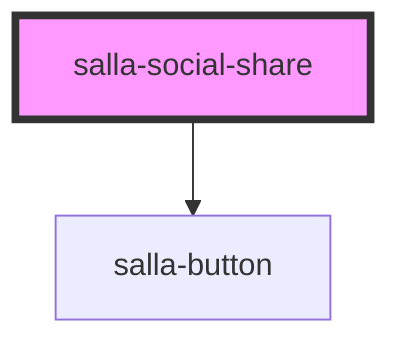

# salla-social-share

<!-- Auto Generated Below -->

## Properties

| Property    | Attribute   | Description                                                  | Type     | Default                                       |
| ----------- | ----------- | ------------------------------------------------------------ | -------- | --------------------------------------------- |
| `platforms` | `platforms` | selected platforms to share \| all platforms                 | `string` | `'facebook,twitter,whatsapp,email,copy_link'` |
| `url`       | `url`       | page url that will be shared custom \| current page url      | `string` | `""`                                          |
| `urlName`   | `url-name`  | page url name that will be shared custom \| current page url | `string` | `""`                                          |

## Methods

### `open() => Promise<void>`

Activate or open the share menu.

#### Returns

Type: `Promise<void>`

### `refresh() => Promise<void>`

#### Returns

Type: `Promise<void>`

## Slots

| Slot       | Description                                                                                |
| ---------- | ------------------------------------------------------------------------------------------ |
| `"widget"` | An action that can be used to activete or open the component by calling the `open` method. |

## Dependencies

### Depends on

- [salla-button](../salla-button)

### Graph

----------------------------------------------

*Built with [StencilJS](https://stenciljs.com/)*
