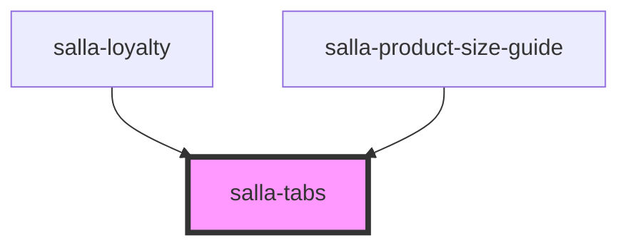

# salla-tabs

<!-- Auto Generated Below -->

## Properties

| Property          | Attribute          | Description            | Type      | Default     |
| ----------------- | ------------------ | ---------------------- | --------- | ----------- |
| `backgroundColor` | `background-color` | Background color       | `string`  | `undefined` |
| `vertical`        | `vertical`         | Align tabs vertically. | `boolean` | `false`     |

## Slots

| Slot        | Description                                                                             |
| ----------- | --------------------------------------------------------------------------------------- |
| `"content"` | The active tab content section. `salla-tab-content` component is used for this purpose. |
| `"header"`  | The tab header section. `salla-tab-header` component is used for this purpose.          |

## Dependencies

### Used by

 - [salla-loyalty](../salla-loyalty)
 - [salla-product-size-guide](../salla-product-size-guide)

### Graph

----------------------------------------------

*Built with [StencilJS](https://stenciljs.com/)*
