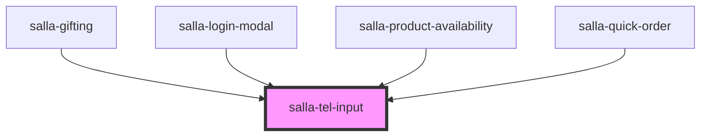

# salla-tel-input

<!-- Auto Generated Below -->

## Properties

| Property      | Attribute      | Description           | Type     | Default                                                 |
| ------------- | -------------- | --------------------- | -------- | ------------------------------------------------------- |
| `countryCode` | `country-code` | Current country_code  | `string` | `salla.config.get('user.country_code', 'SA') \|\| 'SA'` |
| `name`        | `name`         | input name            | `string` | `'phone'`                                               |
| `phone`       | `phone`        | Current mobile number | `string` | `undefined`                                             |

## Events

| Event          | Description                                     | Type                 |
| -------------- | ----------------------------------------------- | -------------------- |
| `phoneEntered` | Event emmitted when user enters a phone number. | `CustomEvent<Phone>` |

## Methods

### `getValues() => Promise<{ [x: string]: any; countryCode: string; countryKey: any; }>`

Get current values

#### Returns

Type: `Promise<{ [x: string]: any; countryCode: string; countryKey: any; }>`

### `isValid() => Promise<boolean>`

Is current data valid or not

#### Returns

Type: `Promise<boolean>`

## Dependencies

### Used by

 - [salla-gifting](../salla-gifting)
 - [salla-login-modal](../salla-login-modal)
 - [salla-product-availability](../salla-product-availability)
 - [salla-quick-order](../salla-quick-order)

### Graph

----------------------------------------------

*Built with [StencilJS](https://stenciljs.com/)*
