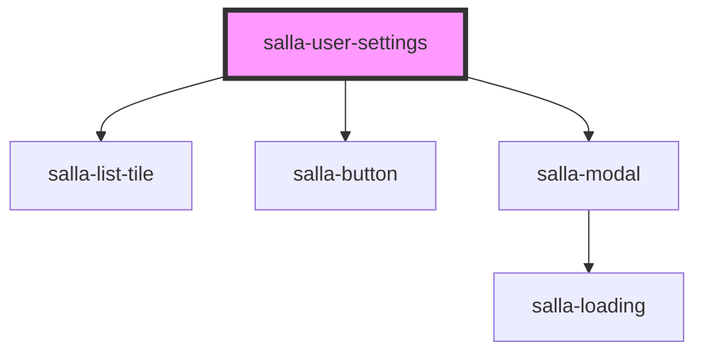

# salla-user-settings

<!-- Auto Generated Below -->

## Properties

| Property       | Attribute       | Description                                            | Type      | Default |
| -------------- | --------------- | ------------------------------------------------------ | --------- | ------- |
| `isNotifiable` | `is-notifiable` | Value used for handling notification toggle check box. | `boolean` | `false` |

## Dependencies

### Depends on

- [salla-list-tile](../salla-list-tile)
- [salla-button](../salla-button)
- [salla-modal](../salla-modal)

### Graph

----------------------------------------------

*Built with [StencilJS](https://stenciljs.com/)*
