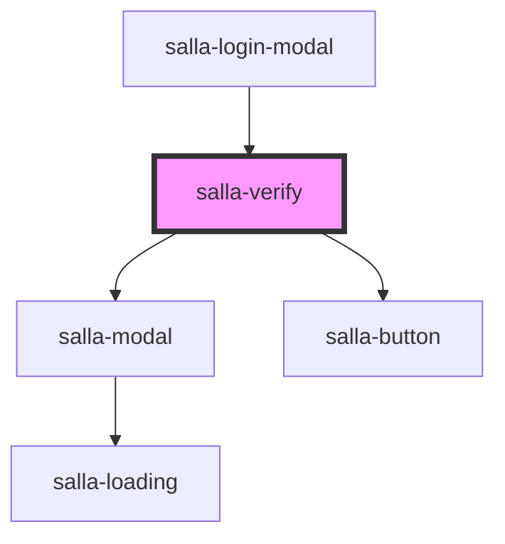

# salla-verify

<!-- Auto Generated Below -->

## Properties

| Property         | Attribute          | Description                                                             | Type                  | Default    |
| ---------------- | ------------------ | ----------------------------------------------------------------------- | --------------------- | ---------- |
| `autoReload`     | `auto-reload`      | should auto reloading the page after success verification               | `boolean`             | `true`     |
| `display`        | `display`          | Should render component without modal                                   | `"inline" \| "modal"` | `'modal'`  |
| `supportWebAuth` | `support-web-auth` | Once the api verify success, it will be login the customer in web pages | `boolean`             | `true`     |
| `type`           | `type`             | Verifying method                                                        | `"email" \| "mobile"` | `'mobile'` |

## Events

| Event      | Description                     | Type               |
| ---------- | ------------------------------- | ------------------ |
| `verified` | Event when success verification | `CustomEvent<any>` |

## Methods

### `getCode() => Promise<string>`

Get current code

#### Returns

Type: `Promise<string>`

### `open(data: any) => Promise<void>`

Open verifying modal

#### Returns

Type: `Promise<void>`

## Slots

| Slot             | Description                                                                   |
| ---------------- | ----------------------------------------------------------------------------- |
| `"after-footer"` | placeholder position                                                          |
| `"footer"`       | Replaces the footer, by default it contains: verify button, resend, and timer |

## Dependencies

### Used by

 - [salla-login-modal](../salla-login-modal)

### Depends on

- [salla-modal](../salla-modal)
- [salla-button](../salla-button)

### Graph

----------------------------------------------

*Built with [StencilJS](https://stenciljs.com/)*
